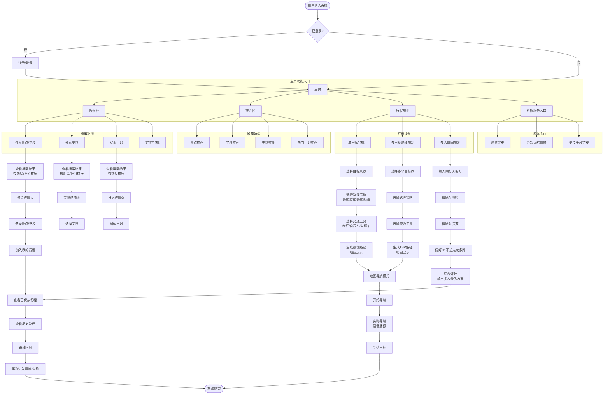
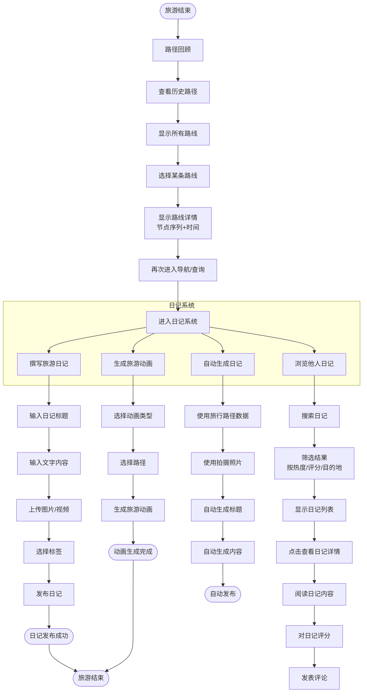
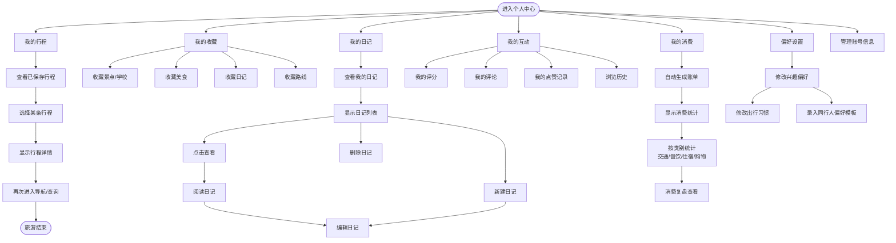

# JourneyCraft 用户操作流程图

## 文档说明
本文档基于《需求分析-功能定义》和《需求分析-功能呈现》两份原始文档整理，使用 Mermaid 语法绘制用户操作流程图。

---

## 1. 旅游前操作流程

```mermaid
flowchart TD
    Start([用户进入系统]) --> Auth{已登录?}

    Auth -->|否| Register[注册/登录]
    Register --> Home

    Auth -->|是| Home[主页]

    subgraph 主页功能入口
        Home --> Search[搜索框]
        Home --> Recommend[推荐区]
        Home --> Plan[行程规划]
        Home --> Service[外部服务入口]
    end

    subgraph 搜索功能
        Search --> SearchAttraction[搜索景点/学校]
        Search --> SearchFood[搜索美食]
        Search --> SearchDiary[搜索日记]
        Search --> SearchLocation[定位/导航]
    end

    subgraph 推荐功能
        Recommend --> RecommendAttraction[景点推荐]
        Recommend --> RecommendSchool[学校推荐]
        Recommend --> RecommendFood[美食推荐]
        Recommend --> RecommendDiary[热门日记推荐]
    end

    subgraph 行程规划
        Plan --> SingleTarget[单目标导航]
        Plan --> MultiTarget[多目标路线规划]
        Plan --> MultiPeople[多人协同规划]
    end

    subgraph 服务入口
        Service --> Ticket[购票链接]
        Service --> Nav[外部导航链接]
        Service --> FoodService[美食平台链接]
    end

    SearchAttraction --> SearchResultAttraction[查看搜索结果<br/>按热度/评分排序]
    SearchFood --> SearchResultFood[查看搜索结果<br/>按距离/评分排序]
    SearchDiary --> SearchResultDiary[查看搜索结果<br/>按热度排序]

    SearchResultAttraction --> AttractionDetail[景点详情页]
    SearchResultFood --> FoodDetail[美食详情页]
    SearchResultDiary --> DiaryDetail[日记详情页]

    AttractionDetail --> SelectAttraction[选择景点/学校]
    FoodDetail --> SelectFood[选择美食]
    DiaryDetail --> ReadDiary[阅读日记]

    SelectAttraction --> AddToItinerary[加入我的行程]
    AddToItinerary --> ItineraryList[查看已保存行程]

    SingleTarget --> SelectTarget1[选择目标景点]
    SelectTarget1 --> Strategy1[选择路径策略<br/>最短距离/最短时间]
    Strategy1 --> Transport1[选择交通工具<br/>步行/自行车/电瓶车]
    Transport1 --> PlanResult1[生成最优路径<br/>地图展示]

    MultiTarget --> SelectTargets[选择多个目标点]
    SelectTargets --> Strategy2[选择路径策略]
    Strategy2 --> Transport2[选择交通工具]
    Transport2 --> PlanResult2[生成TSP路径<br/>地图展示]

    MultiPeople --> InputPreferences[输入同行人偏好]
    InputPreferences --> PreferenceA[偏好A: 照片]
    PreferenceA --> PreferenceB[偏好B: 美食]
    PreferenceB --> PreferenceC[偏好C: 不想走太多路]
    PreferenceC --> AggregateScore[综合评分<br/>输出多人最优方案]

    PlanResult1 --> MapNav[地图导航模式]
    PlanResult2 --> MapNav
    AggregateScore --> ItineraryList

    MapNav --> StartNav[开始导航]
    StartNav --> RealTimeNav[实时导航<br/>语音播报]
    RealTimeNav --> NavigationComplete[到达目标]

    ItineraryList --> ViewHistory[查看历史路径]
    ViewHistory --> ReviewPath[路线回顾]
    ReviewPath --> ReNav[再次进入导航/查询]

    NavigationComplete --> EndTour([旅游结束])
    ReNav --> EndTour
```

---

## 2. 旅游中操作流程

```mermaid
flowchart TD
    Start([进入景区/校园]) --> GetLocation[获取当前位置]

    GetLocation --> EnterMapMode[进入地图导航模式]

    EnterMapMode --> MapFeatures[地图功能]
    MapFeatures --> ShowMap[展示地图<br/>道路图+当前位置]
    MapFeatures --> ShowRoute[规划路径展示]

    subgraph 路径规划
        ShowRoute --> SelectGoal[选择目标点]
        SelectGoal --> SingleNav[单目标导航]
        SelectGoal --> MultiNav[多目标路线规划]

        SingleNav --> GoalInput[输入目标景点]
        GoalInput --> StrategySelect[选择策略<br/>最短距离/最短时间]
        StrategySelect --> TransportSelect[选择交通工具<br/>步行/自行车/电瓶车]
        TransportSelect --> CalcRoute[计算最优路径]
        CalcRoute --> ShowRouteResult[显示路径<br/>地图Polyline展示]

        MultiNav --> MultiGoalInput[输入多个目标点]
        MultiGoalInput --> CalcTSP[计算TSP路径<br/>依次游览所有目标]
        CalcTSP --> ShowTSPResult[显示路径<br/>地图Polyline展示]
    end

    ShowRouteResult --> RouteNav[开始导航]
    ShowTSPResult --> RouteNav

    RouteNav --> RealTimeNav[实时导航]
    RealTimeNav --> VoiceGuidance[语音播报<br/>距离/转弯提示]
    VoiceGuidance --> NextStep[下一步导航]

    NextStep --> CheckCongestion{检测拥堵?}
    CheckCongestion -->|是| SuggestAlternative[建议重新规划]
    SuggestAlternative --> AlternativeRoute[提供替代路线]

    CheckCongestion -->|否| ArriveTarget[到达目标]

    AlternativeRoute --> NewRoute[生成新路径]
    NewRoute --> RouteNav

    ArriveTarget --> CheckNearby{查看附近设施?}

    CheckNearby -->|是| SearchFacility[场所查询]
    CheckNearby -->|否| IndoorNav[进入室内导航]

    SearchFacility --> SelectType[选择设施类型<br/>超市/卫生间/餐饮]
    SelectType --> SearchResultFacility[搜索结果<br/>按实际距离排序]
    SearchResultFacility --> ShowFacility[显示设施位置<br/>地图Marker展示]

    ShowFacility --> FacilityNav[前往设施]

    FacilityNav --> EnterBuilding[进入建筑物]
    EnterBuilding --> IndoorNav

    subgraph 室内导航
        IndoorNav --> FloorNav[楼层间导航]
        FloorNav --> ElevatorNav[电梯导航<br/>切换楼层]

        ElevatorNav --> FloorView[楼层视图]
        FloorView --> RoomNav[楼层内导航]

        RoomNav --> SelectRoom[选择目标房间]
        SelectRoom --> IndoorRoute[生成室内路径<br/>地图展示]
        IndoorRoute --> IndoorNavComplete[到达目标]
    end

    IndoorNavComplete --> CheckPhotoSpot{到达拍照点?}
    CheckPhotoSpot -->|是| ARGuide[AR打卡引导<br/>推荐拍照角度]
    CheckPhotoSpot -->|否| ContinueTour[继续游览]

    ARGuide --> PhotoSpotComplete([拍照打卡完成])
    ContinueTour --> EndTour([旅游结束])
```

---

## 3. 旅游后操作流程

```mermaid
flowchart TD
    Start([旅游结束]) --> ReviewPath[路径回顾]

    ReviewPath --> ViewHistory[查看历史路径]
    ViewHistory --> ShowRouteList[显示所有路线]
    ShowRouteList --> SelectRoute[选择某条路线]

    SelectRoute --> ShowRouteDetail[显示路线详情<br/>节点序列+时间]
    ShowRouteDetail --> ReNav[再次进入导航/查询]

    ReNav --> DiarySection[进入日记系统]

    subgraph 日记系统
        DiarySection --> WriteDiary[撰写旅游日记]
        DiarySection --> BrowseDiary[浏览他人日记]
        DiarySection --> AutoGenerate[自动生成日记]
        DiarySection --> GenerateAnimation[生成旅游动画]
    end

    WriteDiary --> InputTitle[输入日记标题]
    InputTitle --> InputContent[输入文字内容]
    InputContent --> UploadMedia[上传图片/视频]
    UploadMedia --> SelectTags[选择标签]
    SelectTags --> PublishDiary[发布日记]
    PublishDiary --> DiaryPublished([日记发布成功])

    BrowseDiary --> SearchDiary[搜索日记]
    SearchDiary --> FilterResult[筛选结果<br/>按热度/评分/目的地]
    FilterResult --> ShowDiaryList[显示日记列表]
    ShowDiaryList --> ClickDiary[点击查看日记详情]
    ClickDiary --> ReadDiary[阅读日记内容]
    ReadDiary --> RateDiary[对日记评分]
    RateDiary --> CommentDiary[发表评论]

    AutoGenerate --> UsePathData[使用旅行路径数据]
    UsePathData --> UsePhotos[使用拍摄照片]
    UsePhotos --> AutoTitle[自动生成标题]
    AutoTitle --> AutoContent[自动生成内容]
    AutoContent --> AutoPublish([自动发布])

    GenerateAnimation --> SelectAnimation[选择动画类型]
    SelectAnimation --> SelectPath[选择路径]
    SelectPath --> Generate[生成旅游动画]
    Generate --> AnimationComplete([动画生成完成])

    DiaryPublished --> EndTour([旅游结束])
    AnimationComplete --> EndTour
```

---

## 4. 个人中心操作流程

```mermaid
flowchart TD
    Start([进入个人中心]) --> MyTrip[我的行程]
    Start --> MyFavorite[我的收藏]
    Start --> MyDiary[我的日记]
    Start --> MyInteraction[我的互动]
    Start --> MyExpense[我的消费]
    Start --> Settings[偏好设置]
    Start --> ManageAccount[管理账号信息]

    MyTrip --> ViewSaved[查看已保存行程]
    ViewSaved --> SelectSaved[选择某条行程]
    SelectSaved --> ShowTripDetail[显示行程详情]
    ShowTripDetail --> ReNav[再次进入导航/查询]

    MyFavorite --> ViewAttraction[收藏景点/学校]
    MyFavorite --> ViewFood[收藏美食]
    MyFavorite --> ViewDiary[收藏日记]
    MyFavorite --> ViewRoute[收藏路线]

    MyDiary --> ViewMyDiary[查看我的日记]
    ViewMyDiary --> ShowDiaryList[显示日记列表]
    ShowDiaryList --> ClickMyDiary[点击查看]
    ClickMyDiary --> ReadMyDiary[阅读日记]
    ReadMyDiary --> EditDiary[编辑日记]
    ShowDiaryList --> NewDiary[新建日记]
    NewDiary --> EditDiary
    ShowDiaryList --> DeleteDiary[删除日记]
    

    MyInteraction --> ViewRate[我的评分]
    MyInteraction --> ViewComment[我的评论]
    MyInteraction --> ViewLike[我的点赞记录]
    MyInteraction --> ViewHistory[浏览历史]

    MyExpense --> AutoGenerate[自动生成账单]
    AutoGenerate --> ShowExpense[显示消费统计]
    ShowExpense --> ShowCategory[按类别统计<br/>交通/餐饮/住宿/购物]
    ShowCategory --> ShowAnalysis[消费复盘查看]

    Settings --> ModifyInterest[修改兴趣偏好]
    ModifyInterest --> ModifyTrip[修改出行习惯]
    ModifyInterest --> AddPeople[录入同行人偏好模板]
    

    ReNav --> EndTour([旅游结束])
```

---

