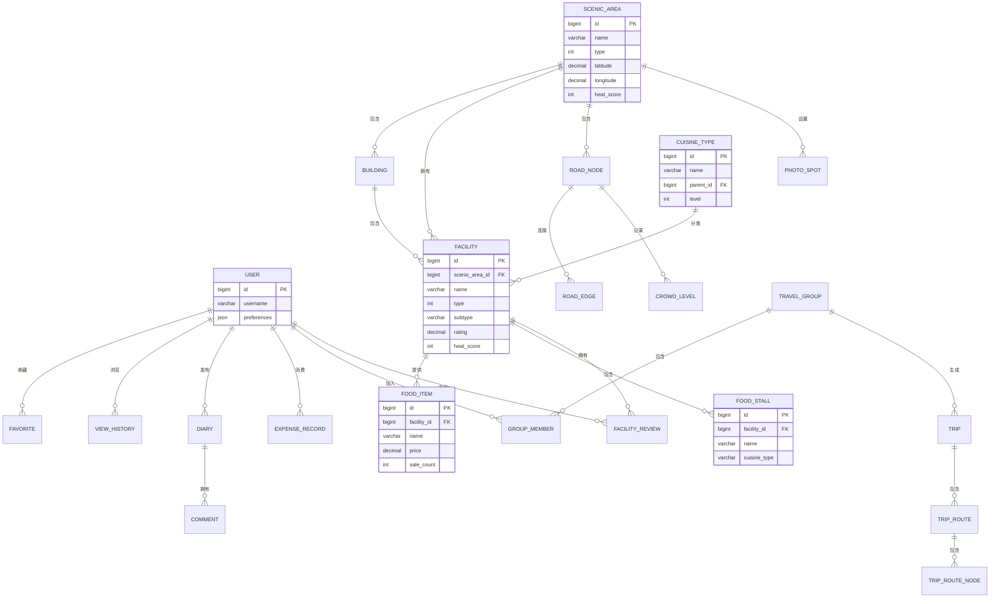

# 一、实体分类总览

```
┌─────────────────────────────────────────────────────────────────┐
│                      JourneyCraft 业务实体                       │
├─────────────────────────────────────────────────────────────────┤
│                                                                 │
│  【核心业务实体】                                                  │
│  User(用户) → ScenicArea(景区/校园) → Building(建筑物)             │
│                          → Facility(设施) → RoadNode/RoadEdge    │
│                                                                 │
│  【导航相关实体】                                                  │
│  RoadNode(路网节点) → RoadEdge(路网边) → PhotoSpot(拍照点)          │
│  → CrowdLevel(拥挤度)                                            │
│                                                                 │
│  【用户行为实体】                                                  │
│  TravelGroup(旅行小组) → GroupMember(小组成员)                    │
│  → Trip/Route(行程/路线) → ExpenseRecord(消费记录)                │
│                                                                 │
│  【内容相关实体】(MongoDB)                                        │
│  Diary(日记) → Comment(评论) → DiaryMedia(日记媒体)               │
│                                                                 │
│  【关系相关实体】                                                 │
│  Favorite(收藏) → ViewHistory(浏览历史) → UserPreference(偏好)     │
│                                                                 │
│  【基础设施实体】                                                 │
│  File(文件-MinIO)                                               │
│                                                                 │
└─────────────────────────────────────────────────────────────────┘
```

---

# 二、完整的实体定义 (清晰版)

### 3.1 基础实体定义规范

**字段命名规则**:

- `id`: 主键 (BIGINT)
- `xxx_id`: 外键 (BIGINT)
- `name`: 名称 (VARCHAR)
- `type`: 类型 (TINYINT/INTEGER)
- `xxx_at`: 时间戳 (DATETIME)

**通用字段**:

- `created_at`: 创建时间
- `updated_at`: 更新时间
- `is_deleted`: 逻辑删除标记 (0:否 1:是)

---

### 3.2 用户相关实体

#### User (用户表)

| 字段            | 类型       | 长度  | 说明             | 示例                  |
| ------------- | -------- | --- | -------------- | ------------------- |
| id            | BIGINT   | 20  | 主键             | 1001                |
| username      | VARCHAR  | 50  | 用户名 (唯一)       | zhangsan            |
| password_hash | VARCHAR  | 128 | 密码哈希           | $2a$10$...          |
| nickname      | VARCHAR  | 50  | 昵称             | 张三                  |
| avatar_url    | VARCHAR  | 255 | 头像 URL         | http://minio/...    |
| phone         | VARCHAR  | 20  | 手机号            | 13800138000         |
| email         | VARCHAR  | 100 | 邮箱             | test@example.com    |
| preferences   | JSON     | -   | 偏好设置           | 见下方                 |
| status        | TINYINT  | 1   | 状态 (1:正常 0:禁用) | 1                   |
| created_at    | DATETIME | -   | 创建时间           | 2024-01-01 10:00:00 |
| updated_at    | DATETIME | -   | 更新时间           | 2024-01-01 10:00:00 |

**preferences 字段结构**:

```json
{
  "interests": ["history", "nature", "photo"],  // 兴趣标签
  "transport_mode": "walk",                      // 默认出行方式
  "food_preferences": ["spicy", "beijing"],      // 饮食偏好 (口味/菜系)
  "max_walk_distance": 3000,                     // 最大步行距离 (米)
  "budget_per_day": 500                          // 日均预算 (元)
}
```

---

### 3.3 景点/校园相关实体

#### ScenicArea (景区/校园表)

| 字段            | 类型       | 长度   | 说明             | 示例              |
| ------------- | -------- | ---- | -------------- | --------------- |
| id            | BIGINT   | 20   | 主键             | 1               |
| name          | VARCHAR  | 100  | 名称             | 故宫              |
| type          | TINYINT  | 1    | 类型 (0:景区 1:校园) | 0               |
| city          | VARCHAR  | 50   | 城市             | 北京              |
| address       | VARCHAR  | 200  | 详细地址           | 北京市东城区景山前街 4 号  |
| latitude      | DECIMAL  | 10,8 | 纬度             | 39.916345       |
| longitude     | DECIMAL  | 11,8 | 经度             | 116.397155      |
| description   | TEXT     | -    | 描述             | 中国明清两代的皇家宫殿...  |
| rating        | DECIMAL  | 3,2  | 评分 (0-5)       | 4.9             |
| heat_score    | INT      | 11   | 热度分            | 9800            |
| visit_count   | INT      | 11   | 浏览数            | 100000          |
| ticket_price  | DECIMAL  | 10,2 | 门票价格           | 60.00           |
| booking_url   | VARCHAR  | 300  | 购票链接           | https://...     |
| opening_hours | JSON     | -    | 开放时间           | 见下方             |
| images        | JSON     | -    | 图片 URL 数组      | ["url1","url2"] |
| contact_info  | VARCHAR  | 100  | 联系电话           | 010-12345678    |
| status        | TINYINT  | 1    | 状态 (1:营业 0:关闭) | 1               |
| created_at    | DATETIME | -    | 创建时间           | -               |
| updated_at    | DATETIME | -    | 更新时间           | -               |

**opening_hours 字段结构**:

```json
{
  "monday": {"open": "08:30", "close": "17:00"},
  "tuesday": {"open": "08:30", "close": "17:00"},
  "wednesday": {"open": "08:30", "close": "17:00"},
  "thursday": {"open": "08:30", "close": "17:00"},
  "friday": {"open": "08:30", "close": "17:00"},
  "saturday": {"open": "08:30", "close": "17:00"},
  "sunday": {"open": "08:30", "close": "17:00"}
}
```

#### Building (建筑物表)

| 字段             | 类型       | 长度   | 说明                                | 示例         |
| -------------- | -------- | ---- | --------------------------------- | ---------- |
| id             | BIGINT   | 20   | 主键                                | 1          |
| scenic_area_id | BIGINT   | 20   | 所属景区 ID                           | 1          |
| name           | VARCHAR  | 100  | 名称                                | 太和殿        |
| type           | TINYINT  | 1    | 类型 (0:教学楼 1:图书馆 2:食堂 3:宿舍 4:景点建筑) | 4          |
| floor_count    | INT      | 3    | 楼层数                               | 3          |
| latitude       | DECIMAL  | 10,8 | 纬度                                | 39.917000  |
| longitude      | DECIMAL  | 11,8 | 经度                                | 116.397000 |
| description    | TEXT     | -    | 描述                                | 故宫三大殿之一... |
| indoor_map     | JSON     | -    | 室内地图数据                            | 见下方        |
| images         | JSON     | -    | 图片 URL 数组                         | ["url1"]   |
| created_at     | DATETIME | -    | 创建时间                              | -          |

**indoor_map 字段结构**:

```json
{
  "floors": [
    {
      "floor_number": 1,
      "floor_name": "一层",
      "map_image_url": "http://minio/...",
      "elevators": [{"x": 100, "y": 50}],
      "stairs": [{"x": 150, "y": 50}],
      "rooms": [{"id": 101, "name": "展厅一", "x": 0, "y": 0, "width": 50, "height": 30}]
    }
  ]
}
```

---

### 3.4 美食相关实体 (详细定义)

#### Facility (设施表) - 包含餐饮设施

| 字段             | 类型       | 长度   | 说明             | 枚举值/示例                                                                     |
| -------------- | -------- | ---- | -------------- | -------------------------------------------------------------------------- |
| id             | BIGINT   | 20   | 主键             | 1                                                                          |
| scenic_area_id | BIGINT   | 20   | 所属景区 ID        | 1                                                                          |
| building_id    | BIGINT   | 20   | 所属建筑 ID (可为空)  | 1                                                                          |
| name           | VARCHAR  | 100  | 名称             | 全聚德烤鸭店                                                                     |
| type           | TINYINT  | 1    | 设施类型           | **0:卫生间 1:餐饮 2:超市 3:停车场 4:售票处 5:游客中心 6:医疗点 7:ATM 8:自动贩卖机 9:摆渡车站 10:自行车租赁** |
| subtype        | VARCHAR  | 50   | 子类型 (菜系)       | 川菜/粤菜/快餐/小吃/食堂                                                             |
| facility_class | TINYINT  | 1    | 餐饮分类           | **0:餐厅 1:小吃 2:食堂 3:外卖窗口 4:美食广场**                                           |
| latitude       | DECIMAL  | 10,8 | 纬度             | 39.917000                                                                  |
| longitude      | DECIMAL  | 11,8 | 经度             | 116.397000                                                                 |
| floor_number   | INT      | 3    | 所在楼层           | 1                                                                          |
| description    | TEXT     | -    | 描述             | 正宗北京烤鸭...                                                                  |
| rating         | DECIMAL  | 3,2  | 评分             | 4.8                                                                        |
| review_count   | INT      | 11   | 评价数            | 1200                                                                       |
| heat_score     | INT      | 11   | 热度分            | 8500                                                                       |
| price_range    | VARCHAR  | 20   | 价格区间           | "50-100"                                                                   |
| opening_hours  | JSON     | -    | 营业时间           | 见下方                                                                        |
| images         | JSON     | -    | 图片 URL 数组      | ["url1","url2"]                                                            |
| contact_info   | VARCHAR  | 100  | 联系电话           | 010-12345678                                                               |
| tags           | JSON     | -    | 标签             | ["老字号","排队","适合聚餐"]                                                        |
| status         | TINYINT  | 1    | 状态 (1:营业 0:关闭) | 1                                                                          |
| created_at     | DATETIME | -    | 创建时间           | -                                                                          |

**opening_hours 字段结构**:

```json
{
  "monday": {"open": "10:00", "close": "22:00"},
  "tuesday": {"open": "10:00", "close": "22:00"},
  "wednesday": {"open": "10:00", "close": "22:00"},
  "thursday": {"open": "10:00", "close": "22:00"},
  "friday": {"open": "10:00", "close": "23:00"},
  "saturday": {"open": "09:00", "close": "23:00"},
  "sunday": {"open": "09:00", "close": "22:00"}
}
```

#### CuisineType (菜系类型表)

| 字段         | 类型       | 长度  | 说明                  | 示例         |
| ---------- | -------- | --- | ------------------- | ---------- |
| id         | BIGINT   | 20  | 主键                  | 1          |
| name       | VARCHAR  | 50  | 菜系名称                | 川菜         |
| parent_id  | BIGINT   | 20  | 父菜系 ID (多级分类)       | 0          |
| level      | TINYINT  | 1   | 层级 (1:一级 2:二级 3:三级) | 1          |
| icon_url   | VARCHAR  | 255 | 图标 URL              | http://... |
| sort_order | INT      | 5   | 排序                  | 1          |
| created_at | DATETIME | -   | 创建时间                | -          |

**菜系层级示例**:

```
一级菜系          二级菜系
├─ 川菜 (id=1)    ├─ 成都菜 (id=11)
│                 ├─ 重庆菜 (id=12)
├─ 粤菜 (id=2)    ├─ 广州菜 (id=21)
│                 └─ 潮汕菜 (id=22)
├─ 鲁菜 (id=3)
├─ 快餐 (id=10)   └─ 西式快餐 (id=101)
└─ 小吃 (id=11)   └─ 地方小吃 (id=111)
```

#### FoodItem (菜品表)

| 字段             | 类型       | 长度   | 说明             | 示例               |
| -------------- | -------- | ---- | -------------- | ---------------- |
| id             | BIGINT   | 20   | 主键             | 1                |
| facility_id    | BIGINT   | 20   | 所属设施 ID        | 1                |
| name           | VARCHAR  | 100  | 菜品名称           | 北京烤鸭             |
| description    | TEXT     | -    | 描述             | 色泽红润，外皮酥脆...     |
| price          | DECIMAL  | 10,2 | 价格             | 198.00           |
| original_price | DECIMAL  | 10,2 | 原价 (划线价)       | 268.00           |
| images         | JSON     | -    | 图片 URL 数组      | ["url1","url2"]  |
| cuisine_type   | VARCHAR  | 50   | 菜系             | 京菜               |
| taste_type     | JSON     | -    | 口味             | ["咸鲜","香酥"]      |
| is_recommend   | TINYINT  | 1    | 是否推荐           | 1                |
| is_signature   | TINYINT  | 1    | 是否招牌菜          | 1                |
| sale_count     | INT      | 11   | 销量             | 5000             |
| rating         | DECIMAL  | 3,2  | 评分             | 4.9              |
| review_count   | INT      | 11   | 评价数            | 800              |
| tags           | JSON     | -    | 标签             | ["必点","招牌","量大"] |
| status         | TINYINT  | 1    | 状态 (1:供应 0:售罄) | 1                |
| created_at     | DATETIME | -    | 创建时间           | -                |
| updated_at     | DATETIME | -    | 更新时间           | -                |

#### FoodStall (摊位/窗口表)

| 字段            | 类型       | 长度  | 说明                | 示例          |
| ------------- | -------- | --- | ----------------- | ----------- |
| id            | BIGINT   | 20  | 主键                | 1           |
| facility_id   | BIGINT   | 20  | 所属设施 ID (食堂/美食广场) | 1           |
| name          | VARCHAR  | 100 | 摊位名称              | 麻辣香锅档       |
| owner_name    | VARCHAR  | 50  | 经营者姓名             | 李四          |
| cuisine_type  | VARCHAR  | 50  | 主营菜系              | 川菜          |
| specialty     | VARCHAR  | 200 | 招牌菜               | 麻辣香锅、酸菜鱼    |
| price_range   | VARCHAR  | 20  | 价格区间              | "15-30"     |
| location_desc | VARCHAR  | 100 | 位置描述              | 食堂二楼 A03 窗口 |
| rating        | DECIMAL  | 3,2 | 评分                | 4.5         |
| review_count  | INT      | 11  | 评价数               | 300         |
| heat_score    | INT      | 11  | 热度分               | 3500        |
| images        | JSON     | -   | 图片 URL 数组         | ["url1"]    |
| opening_hours | JSON     | -   | 营业时间              | -           |
| status        | TINYINT  | 1   | 状态 (1:营业 0:关闭)    | 1           |
| created_at    | DATETIME | -   | 创建时间              | -           |

#### FacilityReview (设施评价表)

| 字段                | 类型       | 长度  | 说明             | 示例                  |
| ----------------- | -------- | --- | -------------- | ------------------- |
| id                | BIGINT   | 20  | 主键             | 1                   |
| facility_id       | BIGINT   | 20  | 设施 ID          | 1                   |
| user_id           | BIGINT   | 20  | 用户 ID          | 1001                |
| rating            | DECIMAL  | 3,2 | 评分 (0-5)       | 4.5                 |
| content           | TEXT     | -   | 评价内容           | 味道不错，环境也很好...       |
| images            | JSON     | -   | 评价图片           | ["url1","url2"]     |
| taste_score       | DECIMAL  | 3,2 | 口味评分           | 4.5                 |
| environment_score | DECIMAL  | 3,2 | 环境评分           | 4.0                 |
| service_score     | DECIMAL  | 3,2 | 服务评分           | 4.5                 |
| cost_score        | DECIMAL  | 3,2 | 性价比评分          | 4.0                 |
| visit_time        | DATETIME | -   | 用餐时间           | 2024-03-20 12:00:00 |
| like_count        | INT      | 11  | 点赞数            | 50                  |
| status            | TINYINT  | 1   | 状态 (1:显示 0:隐藏) | 1                   |
| created_at        | DATETIME | -   | 创建时间           | -                   |

---

### 3.5 导航相关实体

#### RoadNode (路网节点表)

| 字段             | 类型       | 长度   | 说明      | 枚举值/示例                                |
| -------------- | -------- | ---- | ------- | ------------------------------------- |
| id             | BIGINT   | 20   | 主键      | 1                                     |
| scenic_area_id | BIGINT   | 20   | 所属景区 ID | 1                                     |
| name           | VARCHAR  | 100  | 节点名称    | 东门入口                                  |
| node_type      | TINYINT  | 1    | 节点类型    | **0:入口 1:路口 2:POI 3:建筑入口 4:设施 5:拍照点** |
| ref_type       | TINYINT  | 1    | 引用类型    | 0:无 1:建筑 2:设施 3:拍照点                   |
| ref_id         | BIGINT   | 20   | 关联实体 ID | 1                                     |
| latitude       | DECIMAL  | 10,8 | 纬度      | 39.916000                             |
| longitude      | DECIMAL  | 11,8 | 经度      | 116.398000                            |
| floor_number   | INT      | 3    | 所在楼层    | 1 (室内导航用)                             |
| elevation      | DECIMAL  | 6,2  | 海拔高度    | 50.00                                 |
| is_accessible  | TINYINT  | 1    | 是否无障碍   | 1                                     |
| created_at     | DATETIME | -    | 创建时间    | -                                     |

#### RoadEdge (路网边表)

| 字段               | 类型       | 长度   | 说明        | 枚举值/示例                           |
| ---------------- | -------- | ---- | --------- | -------------------------------- |
| id               | BIGINT   | 20   | 主键        | 1                                |
| scenic_area_id   | BIGINT   | 20   | 所属景区 ID   | 1                                |
| from_node_id     | BIGINT   | 20   | 起始节点 ID   | 1                                |
| to_node_id       | BIGINT   | 20   | 目标节点 ID   | 2                                |
| distance         | DECIMAL  | 10,2 | 距离 (米)    | 150.50                           |
| walk_time        | INT      | 6    | 步行时间 (秒)  | 120                              |
| bike_time        | INT      | 6    | 自行车时间 (秒) | 45                               |
| shuttle_time     | INT      | 6    | 电瓶车时间 (秒) | 30                               |
| transport_type   | TINYINT  | 1    | 通行方式      | **0:全部 1:仅步行 2:步行 + 自行车 3:仅电瓶车** |
| is_bidirectional | TINYINT  | 1    | 是否双向      | 1                                |
| is_covered       | TINYINT  | 1    | 是否有遮挡     | 0                                |
| congestion_level | DECIMAL  | 3,2  | 拥挤度 (0-1) | 0.3                              |
| floor_from       | INT      | 3    | 起始楼层      | 1                                |
| floor_to         | INT      | 3    | 目标楼层      | 1                                |
| traffic_data     | JSON     | -    | 实时流量数据    | 见下方                              |
| created_at       | DATETIME | -    | 创建时间      | -                                |

**traffic_data 字段结构**:

```json
{
  "peak_hours": ["09:00-11:00", "14:00-16:00"],
  "current_crowd": 0.3,
  "average_speed": 1.2,
  "last_updated": "2024-03-25 10:00:00"
}
```

#### PhotoSpot (拍照点表)

| 字段                | 类型       | 长度  | 说明       | 示例              |
| ----------------- | -------- | --- | -------- | --------------- |
| id                | BIGINT   | 20  | 主键       | 1               |
| scenic_area_id    | BIGINT   | 20  | 所属景区 ID  | 1               |
| node_id           | BIGINT   | 20  | 关联节点 ID  | 1               |
| name              | VARCHAR  | 100 | 拍照点名称    | 太和殿全景拍摄点        |
| target_name       | VARCHAR  | 100 | 拍摄目标     | 太和殿             |
| recommended_angle | VARCHAR  | 50  | 推荐角度     | 北向拍摄            |
| best_time         | VARCHAR  | 100 | 最佳时间     | 上午 9-11 点       |
| description       | TEXT     | -   | 描述       | 拍摄太和殿全景的最佳位置... |
| sample_image      | VARCHAR  | 255 | 示例图片 URL | http://...      |
| rating            | DECIMAL  | 3,2 | 评分       | 4.8             |
| check_in_count    | INT      | 11  | 打卡次数     | 5000            |
| created_at        | DATETIME | -   | 创建时间     | -               |

#### CrowdLevel (拥挤度记录表)

| 字段             | 类型       | 长度  | 说明        | 枚举值/示例                    |
| -------------- | -------- | --- | --------- | ------------------------- |
| id             | BIGINT   | 20  | 主键        | 1                         |
| scenic_area_id | BIGINT   | 20  | 景区 ID     | 1                         |
| node_id        | BIGINT   | 20  | 节点 ID     | 1                         |
| level          | TINYINT  | 1   | 拥挤等级      | **0:舒适 1:适中 2:拥挤 3:非常拥挤** |
| crowd_count    | INT      | 11  | 人数        | 150                       |
| capacity       | INT      | 11  | 容量        | 500                       |
| recorded_at    | DATETIME | -   | 记录时间      | 2024-03-25 10:00:00       |
| predicted_at   | DATETIME | -   | 预测时间 (未来) | 2024-03-25 11:00:00       |
| source         | TINYINT  | 1   | 数据来源      | **0:传感器 1:用户上报 2:预测值**    |
| created_at     | DATETIME | -   | 创建时间      | -                         |

---

### 3.6 用户行为相关实体

#### TravelGroup (旅行小组表)

| 字段             | 类型       | 长度  | 说明      | 示例                          |
| -------------- | -------- | --- | ------- | --------------------------- |
| id             | BIGINT   | 20  | 主键      | 1                           |
| creator_id     | BIGINT   | 20  | 创建者 ID  | 1001                        |
| name           | VARCHAR  | 100 | 小组名称    | 北京三日游                       |
| scenic_area_id | BIGINT   | 20  | 目标景区 ID | 1                           |
| trip_date      | DATE     | -   | 旅行日期    | 2024-04-01                  |
| description    | TEXT     | -   | 描述      | 一起游故宫...                    |
| preferences    | JSON     | -   | 综合偏好    | 见下方                         |
| final_plan     | JSON     | -   | 最终方案    | 见下方                         |
| status         | TINYINT  | 1   | 状态      | **0:规划中 1:进行中 2:已完成 3:已取消** |
| created_at     | DATETIME | -   | 创建时间    | -                           |
| updated_at     | DATETIME | -   | 更新时间    | -                           |

**preferences 字段结构**:

```json
{
  "interests": ["history", "photo"],
  "transport_mode": "walk",
  "max_walk_distance": 3000,
  "food_preference": ["beijing", "not_spicy"],
  "budget_total": 1000,
  "weights": {
    "interest": 0.4,
    "time": 0.3,
    "budget": 0.3
  }
}
```

**final_plan 字段结构**:

```json
{
  "route": [10, 20, 30, 40],
  "total_distance": 3500,
  "total_time": 4200,
  "segments": [
    {"from": 10, "to": 20, "distance": 800, "time": 600}
  ],
  "stay_durations": {"20": 600, "30": 900},
  "satisfaction_scores": {"1001": 0.9, "1002": 0.85},
  "generated_at": "2024-03-25 10:00:00"
}
```

#### GroupMember (小组成员表)

| 字段          | 类型       | 长度  | 说明    | 枚举值/示例                      |
| ----------- | -------- | --- | ----- | --------------------------- |
| id          | BIGINT   | 20  | 主键    | 1                           |
| group_id    | BIGINT   | 20  | 小组 ID | 1                           |
| user_id     | BIGINT   | 20  | 用户 ID | 1001                        |
| role        | TINYINT  | 1   | 角色    | **0:创建者 1:成员**              |
| preferences | JSON     | -   | 个人偏好  | 同 TravelGroup.preferences   |
| status      | TINYINT  | 1   | 状态    | **0:待确认 1:已接受 2:已拒绝 3:已退出** |
| joined_at   | DATETIME | -   | 加入时间  | -                           |

#### Trip (旅行行程表)

| 字段             | 类型       | 长度   | 说明          | 示例                          |
| -------------- | -------- | ---- | ----------- | --------------------------- |
| id             | BIGINT   | 20   | 主键          | 1                           |
| user_id        | BIGINT   | 20   | 用户 ID       | 1001                        |
| group_id       | BIGINT   | 20   | 小组 ID (可为空) | 1                           |
| scenic_area_id | BIGINT   | 20   | 景区 ID       | 1                           |
| title          | VARCHAR  | 100  | 行程标题        | 故宫一日游                       |
| description    | TEXT     | -    | 描述          | 春日游故宫...                    |
| start_date     | DATE     | -    | 开始日期        | 2024-04-01                  |
| end_date       | DATE     | -    | 结束日期        | 2024-04-01                  |
| status         | TINYINT  | 1    | 状态          | **0:规划中 1:进行中 2:已完成 3:已取消** |
| route_summary  | JSON     | -    | 路线摘要        | 见下方                         |
| total_distance | DECIMAL  | 10,2 | 总距离 (km)    | 3.5                         |
| total_duration | INT      | 6    | 总时长 (分钟)    | 420                         |
| estimated_cost | DECIMAL  | 10,2 | 预估费用        | 200.00                      |
| actual_cost    | DECIMAL  | 10,2 | 实际费用        | 185.00                      |
| visibility     | TINYINT  | 1    | 可见性         | **0:私密 1:好友 2:公开**          |
| created_at     | DATETIME | -    | 创建时间        | -                           |
| updated_at     | DATETIME | -    | 更新时间        | -                           |

**route_summary 字段结构**:

```json
{
  "total_distance": 3500,
  "total_time": 4200,
  "node_count": 8,
  "waypoints": [
    {"node_id": 10, "name": "东门入口", "arrival_time": "09:00"},
    {"node_id": 20, "name": "太和殿", "arrival_time": "09:30"}
  ]
}
```

#### TripRoute (行程路线表)

| 字段               | 类型         | 长度   | 说明          | 示例               |
| ---------------- | ---------- | ---- | ----------- | ---------------- |
| id               | BIGINT     | 20   | 主键          | 1                |
| trip_id          | BIGINT     | 20   | 行程 ID       | 1                |
| route_name       | VARCHAR    | 100  | 路线名称        | 上午路线             |
| route_order      | INT        | 3    | 路线顺序        | 1                |
| geometry         | LINESTRING | -    | 地理路径 (空间数据) | -                |
| transport_mode   | TINYINT    | 1    | 出行方式        | 1:步行 2:自行车 3:电瓶车 |
| distance_km      | DECIMAL    | 10,2 | 距离 (km)     | 1.5              |
| duration_minutes | INT        | 6    | 时长 (分钟)     | 20               |
| start_node_id    | BIGINT     | 20   | 起始节点        | 10               |
| end_node_id      | BIGINT     | 20   | 目标节点        | 20               |
| polyline         | TEXT       | -    | 编码路径        | -                |
| created_at       | DATETIME   | -    | 创建时间        | -                |

#### TripRouteNode (行程路线节点表)

| 字段             | 类型       | 长度  | 说明        | 示例                        |
| -------------- | -------- | --- | --------- | ------------------------- |
| id             | BIGINT   | 20  | 主键        | 1                         |
| route_id       | BIGINT   | 20  | 路线 ID     | 1                         |
| node_sequence  | INT      | 3   | 节点顺序      | 1                         |
| node_type      | TINYINT  | 1   | 节点类型      | 0:入口 1:景点 2:休息点 3:餐饮 4:设施 |
| ref_id         | BIGINT   | 20  | 关联实体 ID   | 20 (节点/设施 ID)             |
| node_name      | VARCHAR  | 100 | 节点名称      | 太和殿                       |
| arrival_time   | DATETIME | -   | 到达时间      | 2024-04-01 09:30:00       |
| departure_time | DATETIME | -   | 离开时间      | 2024-04-01 10:00:00       |
| stay_duration  | INT      | 6   | 停留时长 (分钟) | 30                        |
| notes          | TEXT     | -   | 备注        | 拍照 30 分钟                  |
| photos         | JSON     | -   | 照片 URL 数组 | ["url1","url2"]           |
| rating         | DECIMAL  | 3,2 | 评分        | 5.0                       |
| created_at     | DATETIME | -   | 创建时间      | -                         |

---

### 3.7 内容相关实体 (MongoDB)

#### Diary (日记文档)

```javascript
{
  _id: ObjectId("..."),
  userId: 1001,                    // 作者 ID
  groupId: 1,                      // 关联小组 ID (可选)
  scenicAreaId: 1,                 // 关联景区 ID
  tripId: 1,                       // 关联行程 ID

  // 基本信息
  title: "故宫一日游",
  content: "# 故宫游记\n\n今天天气很好...",  // Markdown 格式
  summary: "春日游故宫，感受皇家气派...",    // 摘要 (自动生成)

  // 媒体
  coverImage: "http://minio/...",
  images: ["http://minio/...", "http://minio/..."],
  videos: [],

  // 游览路径
  path: [
    {
      nodeName: "东门入口",
      nodeId: 10,
      timestamp: ISODate("2024-04-01T09:00:00Z"),
      location: {lat: 39.916, lng: 116.398},
      photoCount: 5
    },
    {
      nodeName: "太和殿",
      nodeId: 20,
      timestamp: ISODate("2024-04-01T09:30:00Z"),
      location: {lat: 39.915, lng: 116.397},
      photoCount: 20
    }
  ],

  // 元数据
  tags: ["历史", "建筑", "拍照", "北京"],
  rating: 4.9,                      // 评分 0-5
  mood: "happy",                    // 心情
  weather: "sunny",                 // 天气
  companions: ["张三", "李四"],     // 同行人

  // 自动生成标记
  isAutoGenerated: false,
  aiSummary: "...",

  // 互动数据
  likeCount: 300,
  viewCount: 5000,
  commentCount: 50,
  shareCount: 20,
  favoriteCount: 100,

  // 可见性
  status: 1,                        // 0:私密 1:公开

  // 时间戳
  visitDate: ISODate("2024-04-01"),
  createdAt: ISODate("2024-04-01T18:00:00Z"),
  updatedAt: ISODate("2024-04-02T10:00:00Z")
}
```

#### Comment (评论文档)

```javascript
{
  _id: ObjectId("..."),
  diaryId: ObjectId("..."),        // 关联日记 ID
  userId: 1002,                    // 评论者 ID
  userNickname: "李四",
  userAvatar: "http://...",

  parentId: null,                  // 父评论 ID (回复时填写)
  replyToUserId: null,             // 回复的目标用户 ID

  content: "拍得真好！求攻略~",
  images: [],

  likeCount: 10,
  replyCount: 2,

  status: 1,                       // 0:隐藏 1:显示
  createdAt: ISODate("2024-04-02T10:00:00Z")
}
```

---

### 3.8 关系/辅助实体

#### Favorite (收藏表)

| 字段            | 类型       | 长度  | 说明      | 枚举值/示例                            |
| ------------- | -------- | --- | ------- | --------------------------------- |
| id            | BIGINT   | 20  | 主键      | 1                                 |
| user_id       | BIGINT   | 20  | 用户 ID   | 1001                              |
| favorite_type | TINYINT  | 1   | 收藏类型    | **0:景点 1:校园 2:建筑 3:设施 4:日记 5:路线** |
| favorite_id   | BIGINT   | 20  | 收藏对象 ID | 1                                 |
| notes         | TEXT     | -   | 备注      | 想去的地方                             |
| created_at    | DATETIME | -   | 创建时间    | -                                 |

#### ViewHistory (浏览历史表)

| 字段            | 类型       | 长度  | 说明       | 示例                  |
| ------------- | -------- | --- | -------- | ------------------- |
| id            | BIGINT   | 20  | 主键       | 1                   |
| user_id       | BIGINT   | 20  | 用户 ID    | 1001                |
| target_type   | TINYINT  | 1   | 目标类型     | 0:景点 1:校园 2:日记 3:设施 |
| target_id     | BIGINT   | 20  | 目标 ID    | 1                   |
| target_name   | VARCHAR  | 100 | 目标名称     | 故宫                  |
| view_duration | INT      | 6   | 浏览时长 (秒) | 120                 |
| view_time     | DATETIME | -   | 浏览时间     | 2024-03-25 10:00:00 |

#### ExpenseRecord (消费记录表)

| 字段             | 类型       | 长度   | 说明         | 枚举值/示例                            |
| -------------- | -------- | ---- | ---------- | --------------------------------- |
| id             | BIGINT   | 20   | 主键         | 1                                 |
| user_id        | BIGINT   | 20   | 用户 ID      | 1001                              |
| group_id       | BIGINT   | 20   | 小组 ID (可选) | 1                                 |
| scenic_area_id | BIGINT   | 20   | 景区 ID      | 1                                 |
| facility_id    | BIGINT   | 20   | 设施 ID (可选) | 1                                 |
| category       | TINYINT  | 1    | 类别         | **0:门票 1:餐饮 2:交通 3:购物 4:住宿 5:其他** |
| amount         | DECIMAL  | 10,2 | 金额         | 100.00                            |
| description    | VARCHAR  | 255  | 描述         | 午餐                                |
| merchant_name  | VARCHAR  | 100  | 商家名称       | 全聚德                               |
| receipt_image  | VARCHAR  | 255  | 小票图片 URL   | http://...                        |
| expense_time   | DATETIME | -    | 消费时间       | 2024-03-25 12:00:00               |
| created_at     | DATETIME | -    | 创建时间       | -                                 |

---

---



---

# 三、核心业务实体关系

### 2.1 用户体系实体

```
┌──────────────────┐
│     User         │  用户
├──────────────────┤
│ id: Long         │
│ username: String │
│ password: String │
│ nickname: String │
│ avatar: String   │
│ preferences: JSON│
│ status: Integer  │
└────────┬─────────┘
         │
    ┌────┼────┬────────────┬───────────────┐
    │    │    │            │               │
    ↓    ↓    ↓            ↓               ↓
┌─────────┐ ┌──────────┐ ┌────────┐ ┌──────────┐ ┌────────────┐
│Favorite │ │ViewHistory│ │Diary   │ │GroupMember│ │ExpenseRecord│
│收藏     │ │浏览历史   │ │日记    │ │小组成员   │ │消费记录    │
└─────────┘ └──────────┘ └────────┘ └──────────┘ └────────────┘
```

**实体说明**:

| 实体                 | 存储          | 说明   | 关键属性                               |
| ------------------ | ----------- | ---- | ---------------------------------- |
| **User**           | MySQL       | 系统用户 | id, username, preferences(JSON)    |
| **UserPreference** | MySQL(JSON) | 用户偏好 | interests[], transportMode, budget |

**偏好设置结构** (JSON):

```json
{
  "interests": ["history", "nature", "photo"],
  "transportMode": "walk",
  "foodPreference": ["beijing", "spicy"],
  "maxWalkDistance": 3000,
  "budget": 1000
}
```

---

### 2.2 景点/校园体系实体

```
┌─────────────────────────┐
│      ScenicArea         │  景区/校园
├─────────────────────────┤
│ id: Long                │
│ name: String            │
│ type: Integer (0/1)     │
│ city: String            │
│ location: GeoPoint      │
│ rating: Decimal         │
│ heatScore: Integer      │
│ ticketPrice: Decimal    │
│ openingHours: JSON      │
└───────────┬─────────────┘
            │
       ┌────┴────┬────────────────┬───────────────┐
       │         │                │               │
       ↓         ↓                ↓               ↓
┌───────────┐ ┌─────────┐ ┌─────────────┐ ┌──────────────┐
│ Building  │ │Facility │ │ RoadNode    │ │ PhotoSpot    │
│ 建筑物    │ │ 设施    │ │ 路网节点    │ │ 拍照点       │
└─────┬─────┘ └─────────┘ └──────┬──────┘ └──────────────┘
      │                          │
      │         ┌────────────────┘
      │         │
      │         ↓
      │   ┌───────────┐
      │   │RoadEdge   │  路网边
      │   └───────────┘
      │
      │    ┌─────────────┐
      └───→│   Floor     │  楼层 (室内导航)
           └─────────────┘
```

**实体说明**:

| 实体             | 存储    | 说明    | 关键属性                                                                  |
| -------------- | ----- | ----- | --------------------------------------------------------------------- |
| **ScenicArea** | MySQL | 景区/校园 | id, name, type, location, rating, heatScore                           |
| **Building**   | MySQL | 建筑物   | id, scenicAreaId, name, type, floorCount, indoorMap                   |
| **Facility**   | MySQL | 服务设施  | id, scenicAreaId, buildingId, type, subtype, location                 |
| **RoadNode**   | MySQL | 路网节点  | id, scenicAreaId, type, location, floorNumber, refId                  |
| **RoadEdge**   | MySQL | 路网边   | id, scenicAreaId, fromNodeId, toNodeId, distance, time, transportType |
| **PhotoSpot**  | MySQL | 拍照点   | id, nodeId, angle, sampleImage, description                           |
| **Floor**      | MySQL | 楼层    | id, buildingId, floorNumber, floorMap                                 |
| **CrowdLevel** | MySQL | 拥挤度记录 | id, nodeId, level, timestamp                                          |

**设施类型枚举**:

```
0: 卫生间 | 1: 餐饮 | 2: 超市 | 3: 停车场 | 4: 售票处
5: 游客中心 | 6: 医疗点 | 7: ATM | 8: 自动贩卖机 | 9: 摆渡车站 | 10: 自行车租赁
```

**建筑物类型枚举**:

```
0: 教学楼 | 1: 图书馆 | 2: 食堂 | 3: 宿舍 | 4: 景点建筑 | 5: 体育馆 | 6: 行政楼
```

**路网节点类型枚举**:

```
0: 入口 | 1: 路口 | 2: POI | 3: 建筑入口 | 4: 设施
```

**路网边属性**:

```java
distance: BigDecimal      // 距离 (米)
walkTime: Integer         // 步行时间 (秒)
bikeTime: Integer         // 自行车时间 (秒)
shuttleTime: Integer      // 电瓶车时间 (秒)
transportType: Integer    // 0:全部 1:仅步行 2:步行 + 自行车
isBidirectional: Boolean  // 是否双向
congestionLevel: Decimal  // 拥挤度 0-1
floorFrom: Integer        // 起始楼层
floorTo: Integer          // 目标楼层
```

---

### 2.3 导航/路径实体

```
┌──────────────────┐     ┌──────────────────┐
│    RoadNode      │────→│    RoadEdge      │
│    路网节点       │     │    路网边         │
└──────────────────┘     └──────────────────┘
         │                       │
         │                       │
         ↓                       ↓
┌──────────────────┐     ┌──────────────────┐
│  TripRouteNode   │     │  TripRouteSegment│
│  路线节点         │     │  路线段           │
└──────────────────┘     └──────────────────┘
```

**实体说明**:

| 实体                | 存储    | 说明   | 关键属性                                                         |
| ----------------- | ----- | ---- | ------------------------------------------------------------ |
| **Trip**          | MySQL | 旅行行程 | id, userId, scenicAreaId, title, startDate, endDate          |
| **TripRoute**     | MySQL | 行程路线 | id, tripId, routeOrder, geometry, transportMode              |
| **TripRouteNode** | MySQL | 路线节点 | id, routeId, sequence, nodeId, arrivalTime, stayDuration     |
| **NavHistory**    | MySQL | 导航历史 | id, userId, scenicAreaId, fromNode, toNode, route, timestamp |

---

### 2.4 协同规划实体

```
┌─────────────────────────┐
│     TravelGroup         │  旅行小组
├─────────────────────────┤
│ id: Long                │
│ creatorId: Long         │
│ name: String            │
│ scenicAreaId: Long      │
│ tripDate: LocalDate     │
│ status: Integer         │
│ preferences: JSON       │
│ finalPlan: JSON         │
└───────────┬─────────────┘
            │
            │ 1:N
            │
            ↓
┌─────────────────────────┐
│     GroupMember         │  小组成员
├─────────────────────────┤
│ groupId: Long           │
│ userId: Long            │
│ role: Integer           │
│ preferences: JSON       │
│ status: Integer         │
└─────────────────────────┘
```

**实体说明**:

| 实体              | 存储    | 说明   | 关键属性                                                 |
| --------------- | ----- | ---- | ---------------------------------------------------- |
| **TravelGroup** | MySQL | 旅行小组 | id, creatorId, scenicAreaId, status, finalPlan(JSON) |
| **GroupMember** | MySQL | 小组成员 | groupId, userId, role, preferences(JSON), status     |

**小组成员偏好结构** (JSON):

```json
{
  "interests": ["history", "photo"],
  "transport": "walk",
  "maxWalkDistance": 3000,
  "foodPreference": ["beijing"],
  "budget": 500,
  "weights": {
    "interest": 0.4,
    "time": 0.3,
    "budget": 0.3
  }
}
```

**最终方案结构** (JSON):

```json
{
  "route": [10, 20, 30, 40],
  "totalDistance": 3500,
  "totalTime": 4200,
  "segments": [...],
  "satisfactionScores": {"1": 0.9, "2": 0.85}
}
```

---

### 2.5 日记/内容实体 (MongoDB)

```
┌─────────────────────────┐
│       Diary             │  日记 (MongoDB)
├─────────────────────────┤
│ _id: ObjectId           │
│ userId: Long            │
│ scenicAreaId: Long      │
│ title: String           │
│ content: String         │
│ images: String[]        │
│ videos: String[]        │
│ path: Path[]            │
│ rating: Decimal         │
│ likeCount: Long         │
│ viewCount: Long         │
└───────────┬─────────────┘
            │ 1:N
            │
            ↓
┌─────────────────────────┐
│      Comment            │  评论 (MongoDB)
├─────────────────────────┤
│ _id: ObjectId           │
│ diaryId: ObjectId       │
│ userId: Long            │
│ parentId: ObjectId      │
│ content: String         │
│ likeCount: Long         │
└─────────────────────────┘
```

**Diary 文档结构**:

```javascript
{
  _id: ObjectId,
  userId: Long,
  groupId: Long,
  scenicAreaId: Long,
  title: String,
  content: String,              // Markdown 格式
  coverImage: String,
  images: [String],             // MinIO 路径数组
  videos: [String],             // MinIO 路径数组
  path: [{                      // 游览路径
    nodeName: String,
    nodeId: Long,
    timestamp: ISODate,
    location: {lat: Double, lng: Double}
  }],
  tags: [String],
  rating: Double,               // 0-5
  mood: String,                 // happy/neutral/sad/excited/tired
  weather: String,
  isAutoGenerated: Boolean,
  aiSummary: String,
  likeCount: Long,
  viewCount: Long,
  commentCount: Long,
  status: Number,               // 0:私密 1:公开
  createdAt: ISODate,
  updatedAt: ISODate
}
```

**Comment 文档结构**:

```javascript
{
  _id: ObjectId,
  diaryId: ObjectId,
  userId: Long,
  parentId: ObjectId,           // 回复评论时填写
  content: String,
  likeCount: Long,
  createdAt: ISODate
}
```

---

### 2.6 消费账单实体

```
┌─────────────────────────┐
│    ExpenseRecord        │  消费记录
├─────────────────────────┤
│ id: Long                │
│ userId: Long            │
│ groupId: Long           │
│ scenicAreaId: Long      │
│ category: Integer       │
│ amount: Decimal         │
│ merchantName: String    │
│ receiptImage: String    │
│ expenseTime: DateTime   │
└─────────────────────────┘
```

**实体说明**:

| 实体                 | 存储    | 说明   | 关键属性                                                         |
| ------------------ | ----- | ---- | ------------------------------------------------------------ |
| **ExpenseRecord**  | MySQL | 消费记录 | id, userId, groupId, category, amount, expenseTime           |
| **ExpenseSummary** | MySQL | 账单统计 | id, groupId, totalAmount, categoryBreakdown(JSON), perPerson |

**消费类别枚举**:

```
0: 门票 | 1: 餐饮 | 2: 交通 | 3: 购物 | 4: 住宿 | 5: 其他
```

**账单统计结构** (JSON):

```json
{
  "totalAmount": 1500.00,
  "categoryBreakdown": {
    "ticket": 200.00,
    "food": 500.00,
    "transport": 300.00,
    "shopping": 400.00,
    "accommodation": 100.00
  },
  "perPerson": 375.00,
  "memberBreakdown": [
    {"userId": 1, "nickname": "张三", "paidAmount": 600.00}
  ]
}
```

---

### 2.7 用户关系实体

```
┌──────────────────┐
│    Favorite      │  收藏
├──────────────────┤
│ id: Long         │
│ userId: Long     │
│ favoriteType: Int│  0:景点 1:校园 2:建筑 3:设施 4:日记
│ favoriteId: Long │
│ notes: String    │
└──────────────────┘

┌──────────────────┐
│  ViewHistory     │  浏览历史
├──────────────────┤
│ id: Long         │
│ userId: Long     │
│ targetType: Int  │  0:景点 1:校园 2:日记 3:设施
│ targetId: Long   │
│ viewTime: DateTime│
└──────────────────┘
```

---

# 六、业务实体生命周期

### 6.1 旅游前阶段

```
用户注册 → 设置偏好 → 浏览推荐 → 搜索景点 → 创建/加入小组
→ 提交个人偏好 → 生成协同方案 → 保存行程
```

**涉及实体**:

- User (创建)
- UserPreference (设置)
- ScenicArea (查询)
- TravelGroup (创建/加入)
- GroupMember (加入)
- Trip (创建)

### 6.2 旅游中阶段

```
进入景区 → 获取位置 → 路径规划 → 导航 → 场所查询
→ 打卡拍照 → 上报拥挤度 → 记录消费
```

**涉及实体**:

- RoadNode/RoadEdge (路径计算)
- TripRouteNode (记录途经点)
- Facility (查询)
- PhotoSpot (推荐)
- CrowdLevel (上报/查询)
- ExpenseRecord (记录)
- ViewHistory (记录)

### 6.3 旅游后阶段

```
查看路径回顾 → 撰写日记 → 上传媒体 → 发布日记
→ 查看账单 → 分享
```

**涉及实体**:

- Trip/TripRoute (回顾)
- Diary (创建)
- DiaryMedia (上传)
- ExpenseRecord (统计)
- Comment (互动)
- Favorite (收藏)

---

# 七、实体间关键业务规则

### 7.1 级联关系

| 主实体          | 从实体               | 级联操作         |
| ------------ | ----------------- | ------------ |
| ScenicArea   | Building          | 删除景区时级联删除建筑物 |
| ScenicArea   | Facility          | 删除景区时级联删除设施  |
| ScenicArea   | RoadNode/RoadEdge | 删除景区时级联删除路网  |
| Building     | Floor             | 删除建筑物时级联删除楼层 |
| TravelGroup  | GroupMember       | 删除小组时级联删除成员  |
| Trip         | TripRoute         | 删除行程时级联删除路线  |
| Diary(Mongo) | Comment(Mongo)    | 删除日记时级联删除评论  |

### 7.2 数据一致性要求

1. **热度分数**: 当用户浏览、点赞日记时，需要更新 ScenicArea.heatScore
2. **评分计算**: ScenicArea.rating = 所有相关 Diary.rating 的平均值
3. **计数同步**: Diary.likeCount/commentCount/viewCount 需要与实际操作保持一致
4. **状态同步**: TravelGroup.status 需要根据 tripDate 和成员状态自动更新

### 7.3 索引设计

```sql
-- 景点表
CREATE INDEX idx_type_city ON t_scenic_area(type, city);
CREATE INDEX idx_heat ON t_scenic_area(heat_score DESC);
CREATE SPATIAL INDEX idx_location ON t_scenic_area(latitude, longitude);

-- 建筑物表
CREATE INDEX idx_scenic ON t_building(scenic_area_id);
CREATE INDEX idx_type ON t_building(type);

-- 设施表
CREATE INDEX idx_scenic_type ON t_facility(scenic_area_id, type);
CREATE INDEX idx_location ON t_facility(latitude, longitude);

-- 路网表
CREATE INDEX idx_scenic_node ON t_road_node(scenic_area_id);
CREATE INDEX idx_from ON t_road_edge(from_node_id);
CREATE INDEX idx_to ON t_road_edge(to_node_id);

-- 日记 (MongoDB)
db.diary.createIndex({userId: 1, createdAt: -1});
db.diary.createIndex({scenicAreaId: 1, rating: -1});
db.diary.createIndex({title: "text", content: "text"});
```

---

# 八、数据规模预估

根据课程要求 (200 景区/校园、每景区 20 建筑、10 设施类型、50 设施、200 边、10 用户):

| 实体            | 计算公式      | 预估数量    |
| ------------- | --------- | ------- |
| ScenicArea    | -         | 200     |
| Building      | 200 × 20  | 4,000   |
| Facility      | 200 × 15  | 3,000   |
| RoadNode      | 200 × 50  | 10,000  |
| RoadEdge      | 200 × 250 | 50,000  |
| Floor         | 4,000 × 5 | 20,000  |
| PhotoSpot     | 200 × 5   | 1,000   |
| User          | -         | 10+     |
| Diary         | 10 × 100  | 1,000+  |
| ExpenseRecord | 10 × 50   | 500+    |
| Favorite      | 10 × 50   | 500+    |
| ViewHistory   | 10 × 1000 | 10,000+ |

**总存储预估**:

- MySQL: ~100 MB
- MongoDB: ~500 MB
- MinIO: ~150 GB (图片 + 视频)
