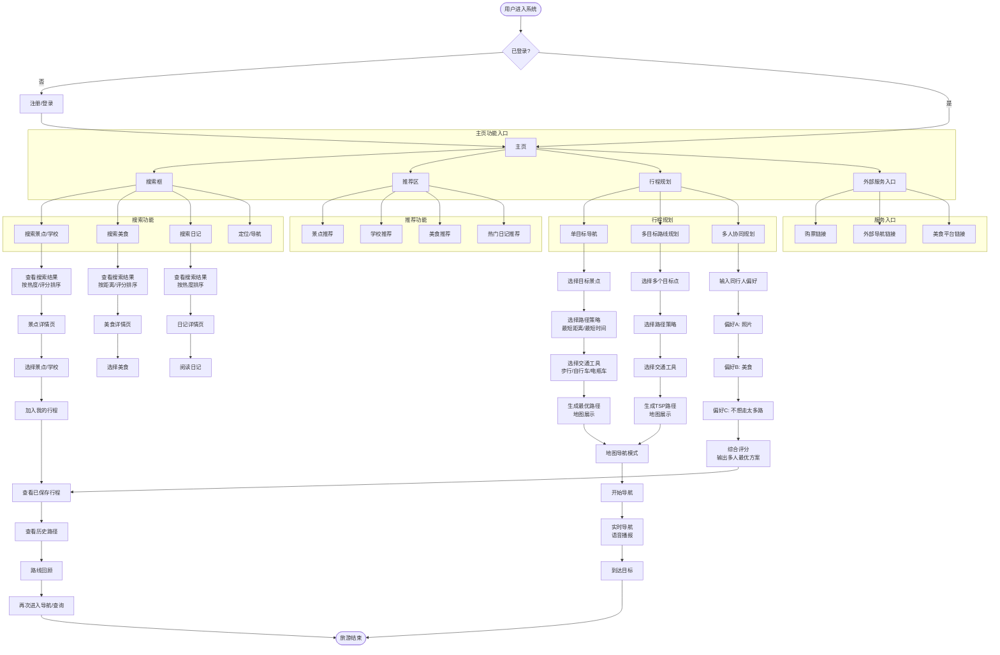
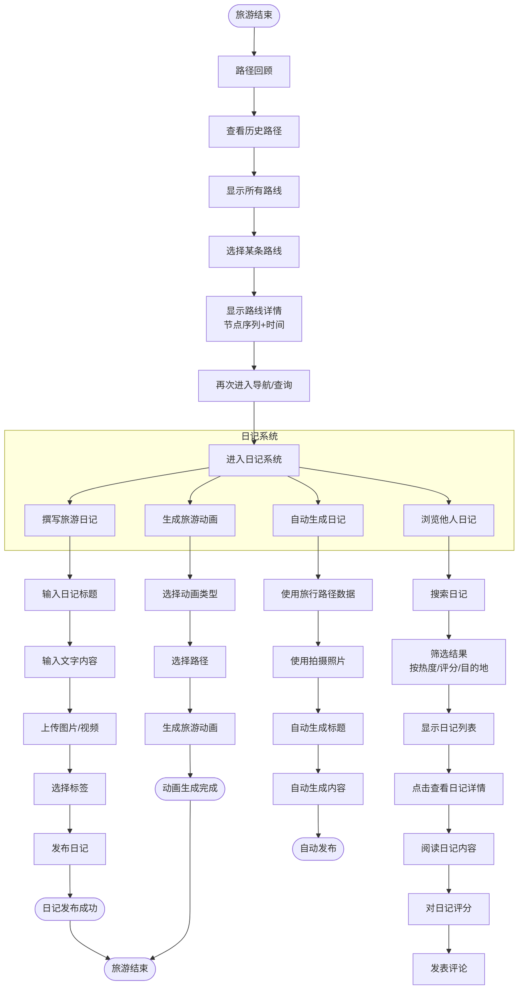
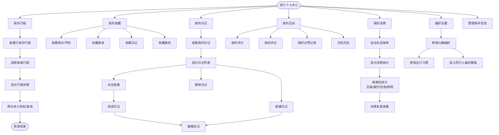
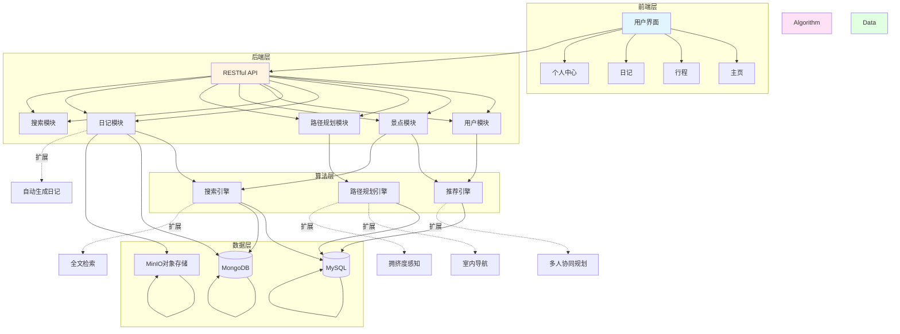
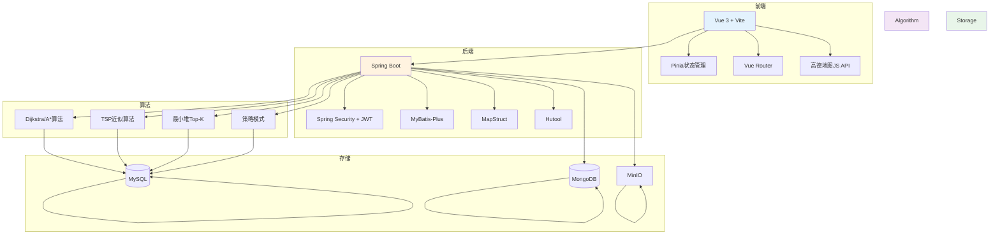
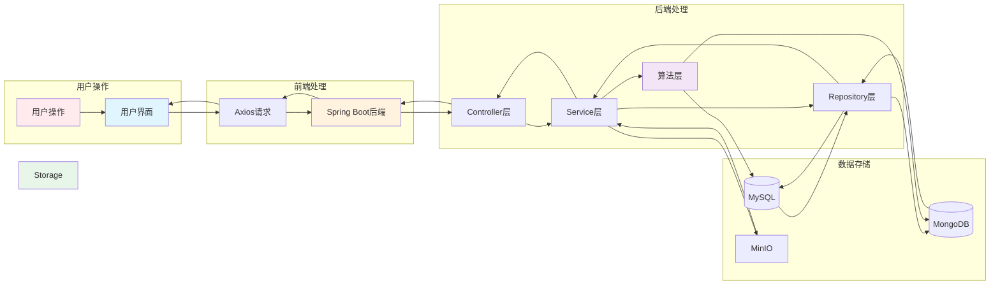
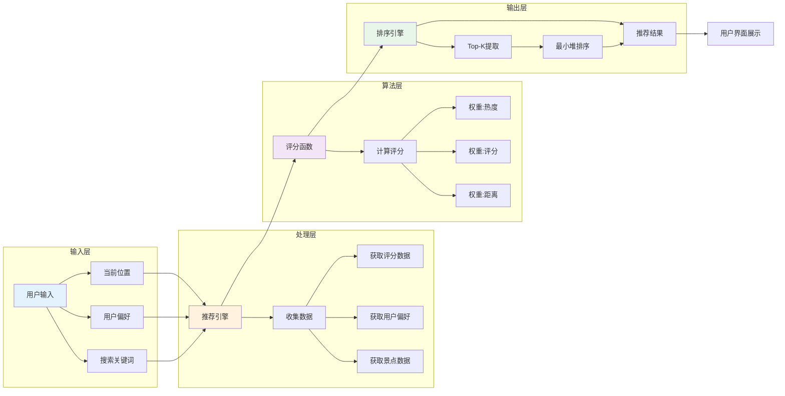
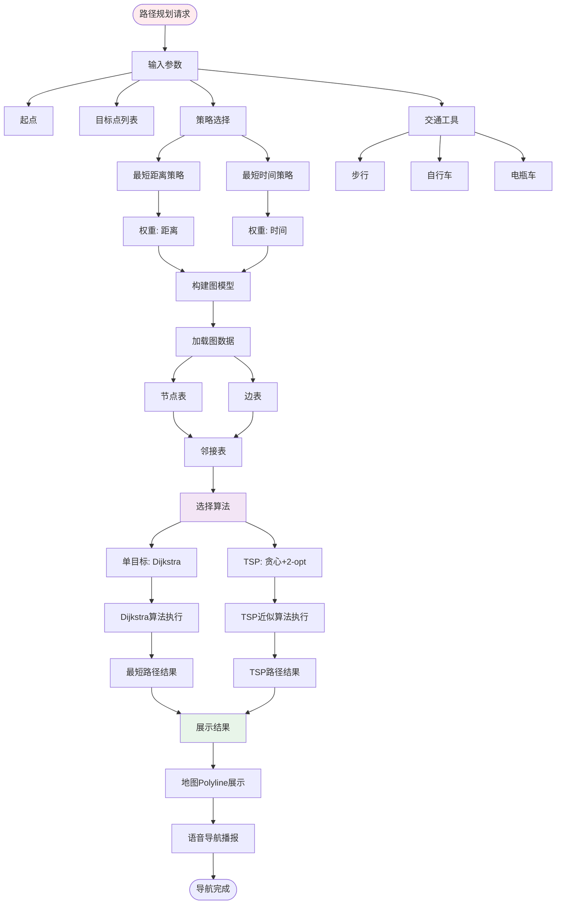
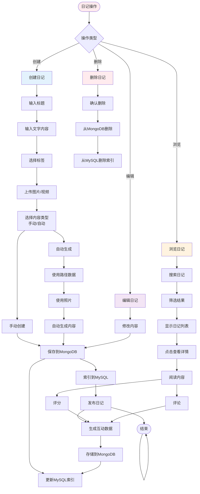

# JourneyCraft 用户操作流程图

## 文档说明
本文档基于《需求分析-功能定义》和《需求分析-功能呈现》两份原始文档整理，使用 Mermaid 语法绘制用户操作流程图。

---

## 1. 旅游前操作流程

---

## 2. 旅游中操作流程

```mermaid
flowchart TD
    Start([进入景区/校园]) --> GetLocation[获取当前位置]

    GetLocation --> EnterMapMode[进入地图导航模式]

    EnterMapMode --> MapFeatures[地图功能]
    MapFeatures --> ShowMap[展示地图<br/>道路图+当前位置]
    MapFeatures --> ShowRoute[规划路径展示]

    subgraph 路径规划
        ShowRoute --> SelectGoal[选择目标点]
        SelectGoal --> SingleNav[单目标导航]
        SelectGoal --> MultiNav[多目标路线规划]

        SingleNav --> GoalInput[输入目标景点]
        GoalInput --> StrategySelect[选择策略<br/>最短距离/最短时间]
        StrategySelect --> TransportSelect[选择交通工具<br/>步行/自行车/电瓶车]
        TransportSelect --> CalcRoute[计算最优路径]
        CalcRoute --> ShowRouteResult[显示路径<br/>地图Polyline展示]

        MultiNav --> MultiGoalInput[输入多个目标点]
        MultiGoalInput --> CalcTSP[计算TSP路径<br/>依次游览所有目标]
        CalcTSP --> ShowTSPResult[显示路径<br/>地图Polyline展示]
    end

    ShowRouteResult --> RouteNav[开始导航]
    ShowTSPResult --> RouteNav

    RouteNav --> RealTimeNav[实时导航]
    RealTimeNav --> VoiceGuidance[语音播报<br/>距离/转弯提示]
    VoiceGuidance --> NextStep[下一步导航]

    NextStep --> CheckCongestion{检测拥堵?}
    CheckCongestion -->|是| SuggestAlternative[建议重新规划]
    SuggestAlternative --> AlternativeRoute[提供替代路线]

    CheckCongestion -->|否| ArriveTarget[到达目标]

    AlternativeRoute --> NewRoute[生成新路径]
    NewRoute --> RouteNav

    ArriveTarget --> CheckNearby{查看附近设施?}

    CheckNearby -->|是| SearchFacility[场所查询]
    CheckNearby -->|否| IndoorNav[进入室内导航]

    SearchFacility --> SelectType[选择设施类型<br/>超市/卫生间/餐饮]
    SelectType --> SearchResultFacility[搜索结果<br/>按实际距离排序]
    SearchResultFacility --> ShowFacility[显示设施位置<br/>地图Marker展示]

    ShowFacility --> FacilityNav[前往设施]

    FacilityNav --> EnterBuilding[进入建筑物]
    EnterBuilding --> IndoorNav

    subgraph 室内导航
        IndoorNav --> FloorNav[楼层间导航]
        FloorNav --> ElevatorNav[电梯导航<br/>切换楼层]

        ElevatorNav --> FloorView[楼层视图]
        FloorView --> RoomNav[楼层内导航]

        RoomNav --> SelectRoom[选择目标房间]
        SelectRoom --> IndoorRoute[生成室内路径<br/>地图展示]
        IndoorRoute --> IndoorNavComplete[到达目标]
    end

    IndoorNavComplete --> CheckPhotoSpot{到达拍照点?}
    CheckPhotoSpot -->|是| ARGuide[AR打卡引导<br/>推荐拍照角度]
    CheckPhotoSpot -->|否| ContinueTour[继续游览]

    ARGuide --> PhotoSpotComplete([拍照打卡完成])
    ContinueTour --> EndTour([旅游结束])
```

---

## 3. 旅游后操作流程

---

## 4. 个人中心操作流程

---

## 5. 核心功能模块关系图

---

## 6. 技术架构流程图

---

## 7. 数据流向图

---

## 8. 推荐系统流程

---

## 9. 路径规划系统流程

---

## 10. 日记系统流程

---

## 图例说明

- **开始/结束节点**：圆形节点，表示流程的开始和结束
- **处理节点**：矩形节点，表示数据处理或操作
- **决策节点**：菱形节点，表示条件判断
- **子流程**：虚线框，表示功能模块的内部流程
- **数据存储**：圆柱体，表示数据库或文件存储

---

*本文档基于 JourneyCraft 需求分析文档整理，使用 Mermaid 语法绘制。*
