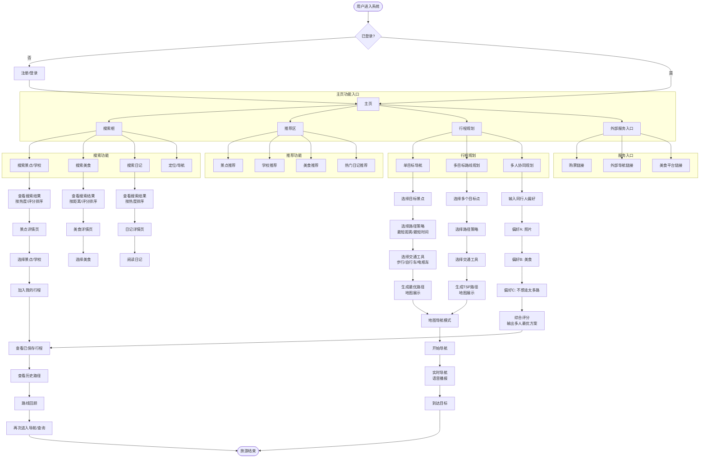
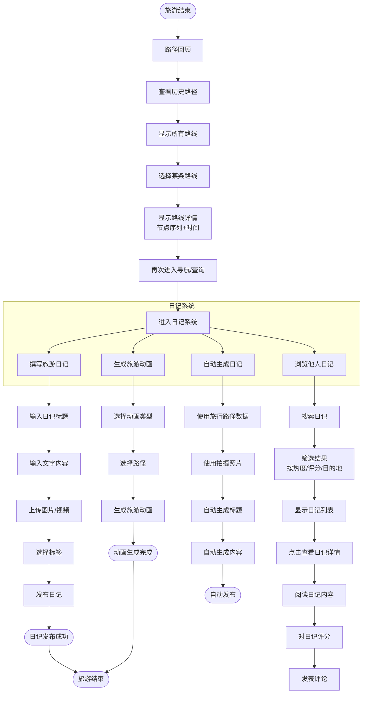
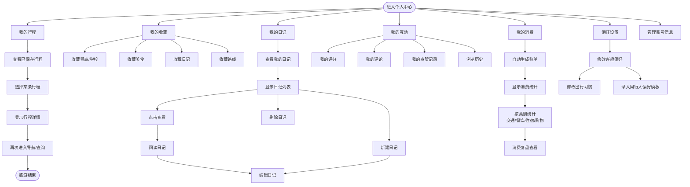

# JourneyCraft 产品计划书

## 一、项目概述

### 1.1 项目名称
**JourneyCraft（行旅）**

### 1.2 项目定位
JourneyCraft 是一款面向**校园导览、景区游览与短途旅行规划**场景的智能旅游推荐系统，围绕用户“**出行前—出行中—出行后**”三个阶段，提供推荐、查询、规划、导航、记录与复盘的一站式服务。项目同时兼顾课程设计要求，强调以**自设计数据结构与核心算法实现系统能力**。

### 1.3 开发任务概述
本项目的核心开发任务包括：

1. 建设完整的旅游 Web 应用产品框架，打通“推荐→规划→导航→记录”业务闭环。  
2. 实现景点/学校/美食/日记/附近设施等对象的搜索、推荐、排序与筛选。  
3. 实现单目标导航、多目标路径规划、室内导航、多交通工具路径策略等核心能力。  
4. 建设旅游日记、收藏、历史记录、消费账单等内容沉淀模块。  
5. 通过智能体参与文档整理、团队协作与工程开发，提高整体交付效率。

### 1.4 项目目标
项目目标并不只是完成一个常规旅游应用，而是打造一个**具备算法深度、场景完整、可演示可落地**的智能旅游规划平台，重点回应传统旅游应用中“信息多但规划弱、功能分散、个性化不足、旅后记录不系统”的问题。

---
## 二、新闻 Q&A 宣传海报

### 3.1 项目新闻稿

**新闻标题：**  
**JourneyCraft（行旅）项目正式启动：打造面向个性化出行与智能规划的一站式旅游服务平台**

**新闻正文：**  
近日，JourneyCraft（行旅）项目正式进入开发筹备阶段。该项目聚焦用户在“出行前、出行中、出行后”三个阶段的核心需求，围绕智能推荐、路线规划、实时导航、旅游日记生成与个人行程管理等场景，探索构建一个更智能、更高效、更个性化的数字化旅游服务平台。

与传统旅游应用侧重信息聚合不同，JourneyCraft 更强调“规划能力”与“决策支持能力”。项目将面向景点、学校、美食、旅游日记、附近设施等多类对象提供搜索、查找、模糊匹配与智能排序能力，并结合用户兴趣偏好、评分、热度、距离等因素，为用户提供更具针对性的内容推荐。

在路径规划方面，JourneyCraft 将支持单目标最短路径、多目标途经点路径优化、最短距离策略、最短时间策略、多交通工具混合规划及室内导航等功能，力求提升用户在景区、校园等复杂场景中的出行效率与体验。项目特别强调，相关导航与附近设施排序将基于道路网络中的实际可达距离，而非简单的几何直线距离。

除导航与推荐外，JourneyCraft 还将探索旅游内容沉淀与个性化服务能力，计划支持自动生成旅游日记、旅游动画生成、个人路径回顾、消费账单统计、收藏与偏好管理等功能，形成从“出发前规划”到“旅后记录复盘”的闭环式旅游服务体验。

### 3.2 对外 Q&A

**Q1：JourneyCraft 是一个什么样的项目？**  
A：JourneyCraft 是一个智能旅游规划系统，核心目标是帮助用户在出行前完成推荐与决策，在出行中完成路线规划与导航，在出行后完成游记与消费等内容沉淀，形成完整闭环。

**Q2：JourneyCraft 解决什么问题？**  
A：主要解决传统旅游应用中信息多但规划弱、功能分散、个性化不足、旅后记录不系统的问题。JourneyCraft 强调推荐、搜索、导航、记录一体化，帮助用户更高效地做出行决策。

**Q3：JourneyCraft 和普通旅游 App 的区别是什么？**  
A：普通旅游 App 更多是提供景点信息、地图或点评聚合，而 JourneyCraft 更强调算法驱动的规划能力。它不仅给内容，还提供排序、筛选、最短路径、多目标路径优化、模糊检索和个性化推荐等能力。

**Q4：项目的核心功能有哪些？**  
A：核心功能包括景点/学校/美食推荐与搜索、旅游日记浏览与推荐、单目标导航、多目标路线规划、附近设施查询、室内导航、自动生成旅游日记、消费账单整理、收藏与偏好管理等。

**Q5：为什么项目叫 JourneyCraft？**  
A：“Journey”代表旅程，“Craft”强调精心打造、智能构建。JourneyCraft 希望表达的是：旅行不是被动浏览信息，而是主动“设计旅程、匠造行程”。这也与项目强调智能规划和个性化体验的定位相匹配。

**Q6：项目有哪些技术亮点？**  
A：技术亮点主要体现在排序算法、查找算法、模糊查询、全文检索、最短路径、多点路径优化、无损压缩以及多交通工具混合策略等方面，同时强调基于自定义数据结构进行实现和算法性能比较。

**Q7：项目中的“智能推荐”体现在哪里？**  
A：推荐将结合热度、评分、距离、兴趣偏好等多种因素，不是简单按单一指标排序。同时在多个场景中强调 Top-K 快速筛选，而非对全部结果做低效全量排序。

**Q8：路线规划有什么特色？**  
A：系统将不仅支持单目标最短路径，还支持多目标途经点路径规划，并考虑最短距离、最短时间、多交通工具混合、道路约束和室内导航等更接近真实场景的规划需求。

**Q9：为什么要做旅游日记和消费账单这些功能？**  
A：因为旅游服务不应只停留在“去哪里”，还应延伸到“如何记录”和“如何复盘”。旅游日记、动画生成、消费账单和历史路径回顾，能够让用户在旅后继续沉淀内容，增强系统完整性和用户粘性。

**Q10：项目适合什么场景？**  
A：适合景区导览、校园导览、城市短途旅游、朋友协同规划、旅游攻略生成等场景，也适合作为课程设计、项目路演和产品原型展示。

**Q11：项目开发前期最关注什么？**  
A：前期最关注三件事：一是需求收敛与场景明确，二是核心算法选型与数据结构设计，三是前后端页面与业务流程的整体架构。

**Q12：项目后续目标是什么？**  
A：后续目标是完成从需求分析、系统设计、核心算法实现、页面开发到性能测试和展示答辩的一体化落地，形成既有产品展示效果、又有算法深度的完整项目成果。

### 3.3 宣传海报

---

## 三、需求分析结果

## 1. 文档概述

### 产品背景

JourneyCraft 是一款面向校园与景区场景的智能旅游推荐系统，为用户提供从行前推荐规划、行中导航游览、行后记录分享的全流程旅游服务。本产品同时服务于数据结构课程设计要求，系统核心算法需基于自设计数据结构实现。

### 目标用户

- **主要用户**：大学生群体，具有校园探索与周边旅游需求
- **次要用户**：景区游客，需要景区内导航、景点推荐等服务
- **用户规模**：系统设计支持不少于 10 名注册用户

### 核心目标

为用户提供"推荐 → 规划 → 导航 → 记录"的一站式旅游体验闭环，以图论与排序算法为核心驱动，基于 Vue 3 + Spring Boot + MySQL/MongoDB 混合存储架构，构建真实可用的 Web 应用系统。

### 适用范围

本 PRD 覆盖 JourneyCraft V2.0 完整功能范围。P0/P1 的划分用于**指导开发优先级与架构分层**。课程要求的所有功能均需在 8 周项目周期内交付。

---

## 2. 功能需求列表（MVP 版本 - P0）

> P0 功能构成核心业务闭环，是系统可运行的最小功能集合。

### 2.1 旅游前 - 推荐与查询

| 模块 | 功能点 | 优先级 | 需求描述 |
|:---|:---|:---|:---|
| 推荐系统 | 景点/学校推荐 | P0 | 用户可选择不同景点和学校作为目的地，系统根据旅游热度、评价和个人兴趣进行推荐，支持按热度、评价排序。需实现 Top-K 优化，快速获取前若干热门结果 | 
| 推荐系统 | 美食推荐 | P0 | 在选中景点/学校后，按热度、评价和距离对美食排序；支持按菜系过滤；支持按名称/菜系/饭店名称模糊查询 | 
| 信息查询 | 景点信息查询 | P0 | 用户可通过名称、类别、关键字搜索景点/学校；多结果时支持按热度、评价排序；展示景点介绍、点评信息、美食信息 |
| 信息查询 | 场所查询 | P0 | 用户选中某景点/场所后，查询附近一定范围内的服务设施（超市、卫生间、餐饮等），按实际距离（非直线距离）排序，支持按类别过滤 | 
| 用户系统 | 用户注册/登录 | P0 | 用户可通过账号密码注册登录，支持用户信息管理 |
| 用户系统 | 个人偏好设置 | P0 | 用户可设置兴趣偏好（景点类别、菜系偏好等）和出行偏好（步行/骑行等） |

### 2.2 旅游中 - 导航与规划

| 模块 | 功能点 | 优先级 | 需求描述 |
|:---|:---|:---|:---|
| 路径规划 | 景区内导航（单目标） | P0 | 用户输入目标景点，系统从当前位置规划最优路径；支持地图展示和路径展示 |
| 路径规划 | 多目标路线规划 | P0 | 用户输入多个目标点，系统规划从起点依次游览全部目标并返回起点的最优路线（TSP 问题） |
| 路径规划 | 多种路径规划策略 | P0 | 支持最短距离策略（总路程最短）、最短时间策略（结合道路拥挤度后总时间最短） |
| 路径规划 | 多交通工具策略 | P0 | 校园场景：步行、自行车；景区场景：步行、电瓶车；不同工具可组合以实现时间最优 |
| 路径规划 | 地图展示 | P0 | 在地图上展示景区/校园道路图、当前位置、目标点、规划路径 |
| 行程管理 | 保存/查看行程 | P0 | 用户可将规划好的行程保存，支持查看已保存行程和历史路径回顾 |
| 服务链接 | 旅游服务链接 | P0 | 针对选定景点，提供购票链接、导航出行链接、美食服务链接等外部服务入口 |

### 2.3 旅游后 - 记录与分享

| 模块 | 功能点 | 优先级 | 需求描述 |
|:---|:---|:---|:---|
| 日记系统 | 旅游日记 CRUD | P0 | 用户可撰写旅游日记（支持文字、图片、视频），可编辑、删除已发布日记 |
| 日记系统 | 日记浏览与评分 | P0 | 用户可浏览所有日记，按热度（浏览量）、评分排序；可对日记进行评分 |
| 日记系统 | 日记检索 | P0 | 支持按目的地查询日记；支持按热度、评分排序；支持按日记名称精确查询 |
| 个人中心 | 我的收藏 | P0 | 用户可收藏景点、学校、美食、日记、路线 |
| 个人中心 | 历史记录 | P0 | 用户可查看搜索历史、浏览历史、路径回顾、场所查询历史 |

---

## 3. 功能需求列表（未来迭代规划 - P1）

> P1 功能为体验增强型或技术复杂度较高的功能，依赖 P0 阶段奠定的架构基础。所有 P1 功能均需在课程周期内交付。

### 3.1 协同与智能化增强

| 模块 | 功能点 | 预计阶段 | 需求描述 |
|:---|:---|:---|:---|
| 推荐系统 | 同行人协同规划 | P1 | 多人出行时，综合每位同行人的偏好进行折中推荐，输出多人最优方案 |
| 日记系统 | 自动生成旅游日记 | P1 | 根据用户的旅行路径、拍摄照片、文字描述等，自动生成旅游日记 |
| 日记系统 | 旅游动画生成 | P1 | 基于图片、文字描述等信息生成旅游动画 |
| 个人中心 | 消费账单自动生成 | P1 | 根据门票购买记录、酒店预订记录等，自动生成消费账单，按交通/住宿/餐饮/购物分类统计 |

### 3.2 导航与体验增强

| 模块 | 功能点 | 预计阶段 | 需求描述 |
|:---|:---|:---|:---|
| 导航系统 | 室内导航 | P1 | 支持建筑物内部导航：大门→电梯、楼层间导航、楼层内→房间导航 |
| 导航系统 | 实时拥挤度感知 | P1 | 实时显示景区内不同区域拥挤程度（红/黄/绿标识），检测拥堵时自动提示重新规划路线 |
| 导航系统 | 反向游览建议 | P1 | 当检测到拥堵时，引导用户前往人少区域游览 |
| 互动功能 | AR 式打卡引导 | P1 | 用户到达景点后，系统自动弹出推荐拍照角度/点位，简化为"拍照点推荐 + 打卡任务"模式 |
| 日记系统 | 日记全文检索 | P1 | 支持按日记内容进行全文关键词检索 |
| 日记系统 | 日记按距离推荐 | P1 | 用户输入目的地查看相关日记时，增加按距离排序 |

---

## 四、用户操作逻辑流程图

### 1. 旅游前操作流程

---

### 2. 旅游中操作流程

```mermaid
flowchart TD
    Start([进入景区/校园]) --> GetLocation[获取当前位置]

    GetLocation --> EnterMapMode[进入地图导航模式]

    EnterMapMode --> MapFeatures[地图功能]
    MapFeatures --> ShowMap[展示地图<br/>道路图+当前位置]
    MapFeatures --> ShowRoute[规划路径展示]

    subgraph 路径规划
        ShowRoute --> SelectGoal[选择目标点]
        SelectGoal --> SingleNav[单目标导航]
        SelectGoal --> MultiNav[多目标路线规划]

        SingleNav --> GoalInput[输入目标景点]
        GoalInput --> StrategySelect[选择策略<br/>最短距离/最短时间]
        StrategySelect --> TransportSelect[选择交通工具<br/>步行/自行车/电瓶车]
        TransportSelect --> CalcRoute[计算最优路径]
        CalcRoute --> ShowRouteResult[显示路径<br/>地图Polyline展示]

        MultiNav --> MultiGoalInput[输入多个目标点]
        MultiGoalInput --> CalcTSP[计算TSP路径<br/>依次游览所有目标]
        CalcTSP --> ShowTSPResult[显示路径<br/>地图Polyline展示]
    end

    ShowRouteResult --> RouteNav[开始导航]
    ShowTSPResult --> RouteNav

    RouteNav --> RealTimeNav[实时导航]
    RealTimeNav --> VoiceGuidance[语音播报<br/>距离/转弯提示]
    VoiceGuidance --> NextStep[下一步导航]

    NextStep --> CheckCongestion{检测拥堵?}
    CheckCongestion -->|是| SuggestAlternative[建议重新规划]
    SuggestAlternative --> AlternativeRoute[提供替代路线]

    CheckCongestion -->|否| ArriveTarget[到达目标]

    AlternativeRoute --> NewRoute[生成新路径]
    NewRoute --> RouteNav

    ArriveTarget --> CheckNearby{查看附近设施?}

    CheckNearby -->|是| SearchFacility[场所查询]
    CheckNearby -->|否| IndoorNav[进入室内导航]

    SearchFacility --> SelectType[选择设施类型<br/>超市/卫生间/餐饮]
    SelectType --> SearchResultFacility[搜索结果<br/>按实际距离排序]
    SearchResultFacility --> ShowFacility[显示设施位置<br/>地图Marker展示]

    ShowFacility --> FacilityNav[前往设施]

    FacilityNav --> EnterBuilding[进入建筑物]
    EnterBuilding --> IndoorNav

    subgraph 室内导航
        IndoorNav --> FloorNav[楼层间导航]
        FloorNav --> ElevatorNav[电梯导航<br/>切换楼层]

        ElevatorNav --> FloorView[楼层视图]
        FloorView --> RoomNav[楼层内导航]

        RoomNav --> SelectRoom[选择目标房间]
        SelectRoom --> IndoorRoute[生成室内路径<br/>地图展示]
        IndoorRoute --> IndoorNavComplete[到达目标]
    end

    IndoorNavComplete --> CheckPhotoSpot{到达拍照点?}
    CheckPhotoSpot -->|是| ARGuide[AR打卡引导<br/>推荐拍照角度]
    CheckPhotoSpot -->|否| ContinueTour[继续游览]

    ARGuide --> PhotoSpotComplete([拍照打卡完成])
    ContinueTour --> EndTour([旅游结束])
```

---

### 3. 旅游后操作流程

---

### 4. 个人中心操作流程

---

## 五、智能体相关信息

### 5.1 智能体设计概述
为提升 JourneyCraft 项目的开发效率、协作能力和工程实现质量，本项目结合 OpenClaw 与 Claude Code 设计了三类智能体：文书智能体、协作智能体、工程智能体。

其中，OpenClaw 主要用于任务拆分、流程组织和多智能体协同设计，Claude Code 主要用于代码生成、技术实现辅助和文档补全。通过两者结合，智能体能够参与项目需求分析、团队协作、工程开发和成果整理的全过程。

### 5.2 文书智能体
文书智能体主要负责项目中的文字材料生成与整理，包括需求文档、设计报告、项目简介、新闻稿、答辩稿、Q&A 材料等。

其作用是提高文档撰写效率，统一文本风格，减少重复整理工作，使项目在需求分析、阶段汇报和成果展示中形成完整、规范的书面材料。

### 5.3 协作智能体
协作智能体主要负责团队开发过程中的任务协调、信息同步和文档共享。

该智能体通过部署在飞书上的机器人接口实现，不同成员可以借助飞书机器人完成项目通知、任务分发、进度同步以及文档共享等操作。

在 JourneyCraft 项目中，协作智能体能够帮助团队及时同步需求变更、汇总讨论结果、共享设计文档和开发资料，从而降低多人协作中的沟通成本，提高项目推进效率。

### 5.4 工程智能体
工程智能体主要负责技术实现相关工作，包括代码框架生成、模块设计辅助、算法实现建议、接口说明整理、测试与问题排查等。

在 JourneyCraft 项目中，工程智能体重点服务于推荐、搜索、路径规划、日记管理等模块的开发，帮助团队更快完成从需求到代码的落地。

### 5.5 三类智能体的协同方式
在项目开发过程中，三类智能体分工明确、相互配合：

- 协作智能体负责拆分任务和组织流程
- 工程智能体负责具体技术实现
- 文书智能体负责整理输出文档和展示材料

这种协同方式使智能体不仅参与单点工作，还能够覆盖项目的需求、开发、测试和汇报全过程。

### 5.6 应用效果总结
通过引入文书智能体、协作智能体和工程智能体，JourneyCraft 项目在文档整理、团队协作和工程实现方面都获得了明显提升。

其中，文书智能体提高了材料产出效率，协作智能体借助飞书机器人增强了成员之间的信息共享与协同能力，工程智能体提升了系统开发和问题排查效率。整体上，智能体体系增强了项目推进效率，也提升了项目成果输出的完整性与规范性。

---

## 六、开发计划
### 版本规划
- **V1.0 MVP**：聚焦 P0 基本功能，第 2-4 周交付
- **V1.1 迭代**：聚焦 P1 进阶功能，第 5-7 周交付

---

### 7周开发进度表

| 周次 | 阶段 | 核心任务 | 预期交付 |
|------|------|---------|---------|
| **第 1 周** | 基础架构搭建 | 1. 前后端项目脚手架初始化 2. MySQL/MongoDB/MinIO 环境搭建 3. 数据库表结构设计与建表 4. Spring Security + JWT 认证实现 5. Knife4j API 文档配置 6. 前端路由与状态管理初始化 | 项目可运行框架 数据库完整表结构 用户登录接口可用 |
| **第 2 周** | 核心数据层 | 1. 景点/学校数据录入（200+） 2. 建筑物/设施数据录入 3. 道路图数据录入（200+ 边） 4. 用户系统完善（注册/登录/偏好设置） 5. MyBatis-Plus CRUD 基础实现 | 完整数据层 推荐/查询功能可用 |
| **第 3 周** | 路径规划核心 | 1. Dijkstra/A* 算法实现 2. 单目标导航功能 3. TSP 近似算法实现 4. 多目标路线规划 5. 多种路径策略（距离/时间） 6. 多交通工具策略 7. 地图展示（高德地图集成） | 路径规划功能可用 地图展示正常 |
| **第 4 周** | 日记系统与收尾 | 1. MongoDB 日记集合设计 2. 日记 CRUD 功能 3. 日记浏览与评分 4. 日记检索（MySQL + MongoDB） 5. 收藏与历史记录 6. 集成测试与 Bug 修复 7. MVP 验收演示准备 | P0 所有功能交付 MVP 可演示运行 |
| **第 5 周** | 室内导航增强 | 1. 图模型扩展（楼层/房间属性） 2. 室内导航算法适配 3. 楼层间导航实现 4. 室内地图展示 5. 场所查询优化（真实距离） | 室内导航可用 |
| **第 6 周** | 智能化与交互 | 1. 同行人协同规划（偏好聚合） 2. 实时拥挤度感知（权重 γ） 3. 反向游览建议 4. AR 打卡引导（拍照点） 5. 日记全文检索（MongoDB text index） 6. 日记按距离推荐 | P1-A 功能完成 |
| **第 7 周** | 自动化与优化 | 1. 自动生成旅游日记（模板拼接） 2. 旅游动画生成（MinIO 存储） 3. 消费账单自动生成 4. UI 打磨与响应式适配 5. 性能优化（Top-K 堆排序、索引） 6. 完整集成测试 7. 文档整理与交付 | 全功能交付 V1.0 最终版本 |

---

### 团队分工（3人并行）

| 角色 | 第 1-4 周（MVP） | 第 5-7 周（进阶） |
|------|-----------------|-----------------|
| **前端开发** | 主页/搜索/推荐/地图/行程/日记/个人中心 | 室内地图/AR 打卡/动画展示/响应式优化 |
| **后端开发** | 路径规划算法/推荐算法/日记系统/用户系统 | 拥挤度计算/协同聚合/全文检索/消费账单 |
| **数据库专家** | 数据录入（200+ 景点/建筑/设施/道路图）| 室内数据录入（楼层/房间）| 拥挤度模拟数据 |

---

### 关键里程碑

| 里程碑 | 时间 | 交付物 | 验收标准 |
|--------|------|--------|---------|
| **M1 - 基础架构** | 第 1 周末 | 项目框架 + 数据库表结构 | 可运行，用户可登录 |
| **M2 - 核心功能** | 第 4 周末 | P0 所有功能可用 | 推荐可演示，导航可运行，日记可操作 |
| **M3 - 室内导航** | 第 5 周末 | 室内导航功能可用 | 楼层间/楼内导航正常 |
| **M4 - 智能增强** | 第 6 周末 | P1-A 功能完成 | 协同规划/拥挤度感知可用 |
| **M5 - 全功能交付** | 第 7 周末 | V1.0 最终版本 | 所有功能完整演示，性能达标 |

---
## 七、技术栈选型

### 1.1 前端技术栈

| 组件    | 技术选型               | 说明      |
| ----- | ------------------ | ------- |
| 框架    | Vue 3.4 + Vite 5.x | 轻量快速    |
| UI 组件 | Element Plus 2.x   | 企业级组件库  |
| 状态管理  | Pinia 2.x          | 轻量状态管理  |
| 地图    | 高德地图 JS API 2.0    | 地图展示与导航 |
| HTTP  | Axios              | 请求库     |
| 路由    | Vue Router 4.x     | 前端路由    |

### 1.2 后端技术栈

| 组件   | 技术选型                  | 说明                  |
| ---- | --------------------- | ------------------- |
| 框架   | Spring Boot 3.2.x     | 主框架                 |
| ORM  | MyBatis-Plus 3.5.x    | 数据库操作               |
| 文档   | Knife4j 4.4.x         | API 文档 (Swagger UI) |
| 对象映射 | MapStruct 1.5.x       | DTO 转换              |
| 工具类  | Hutool 5.8.x          | 工具类库                |
| JSON | Jackson               | JSON 序列化            |
| 认证   | Spring Security + JWT | 用户认证                |

### 1.3 数据存储

| 类型   | 技术选型        | 用途                  |
| ---- | ----------- | ------------------- |
| 关系型  | MySQL 8.0   | 用户、景点、建筑、设施、路径等核心数据 |
| 文档型  | MongoDB 7.0 | 旅游日记、评论、非结构化数据      |
| 对象存储 | MinIO       | 图片、视频等文件存储          |

## 八、开发模式和团队协作方法

- **项目整体**：瀑布流模式，按上述 4 阶段推进
- **代码管理**：Git 功能分支工作流（feature/* / fix/* / release/*）
- **团队协作**：定期线下开会 + 飞书文档共享
- **接口规范**：后端通过 Knife4j 维护实时 API 文档，前端据此联调
